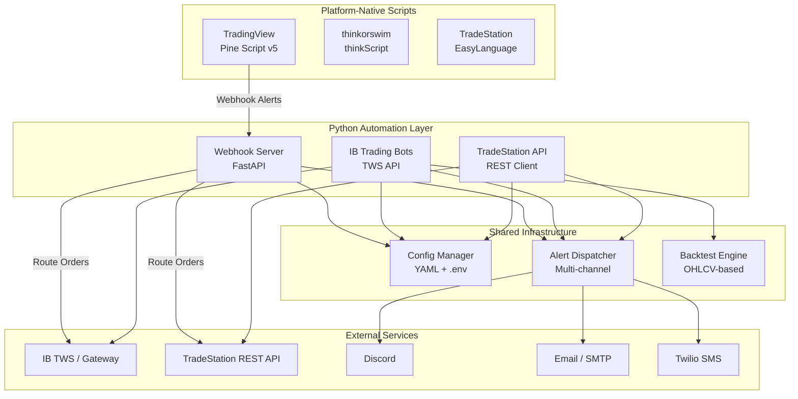
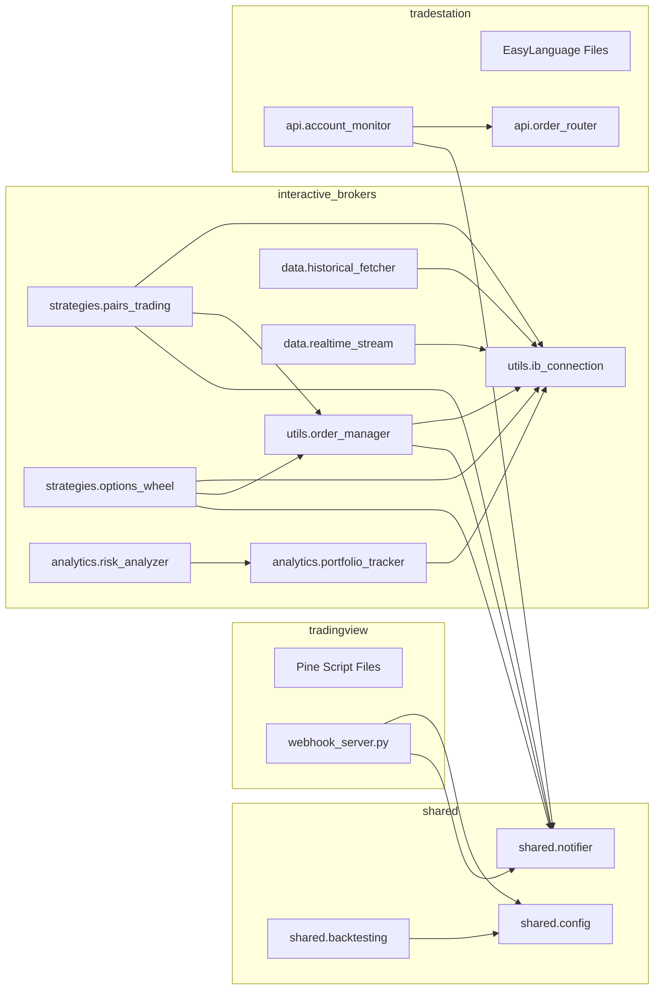
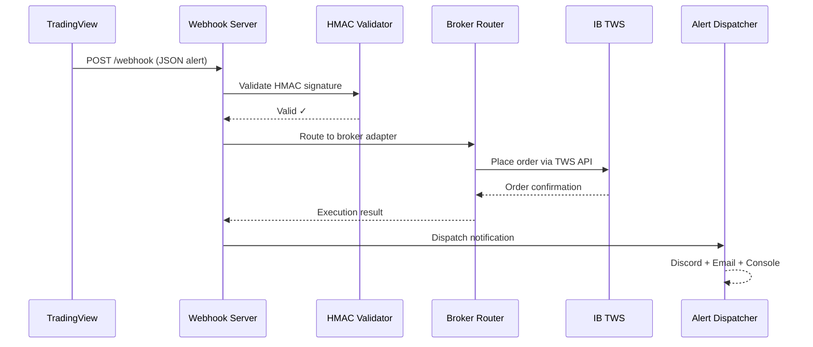
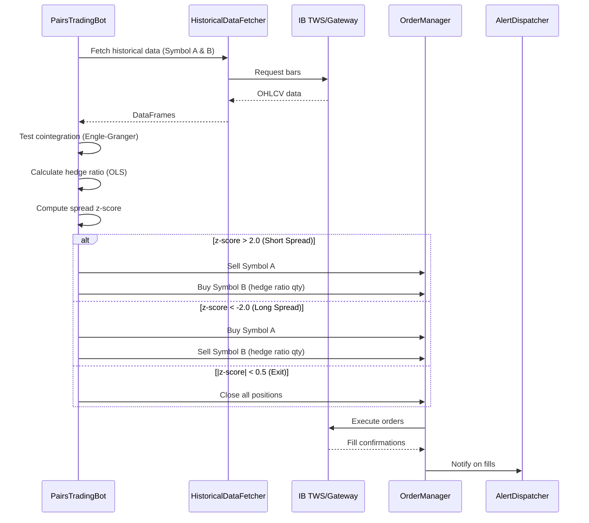
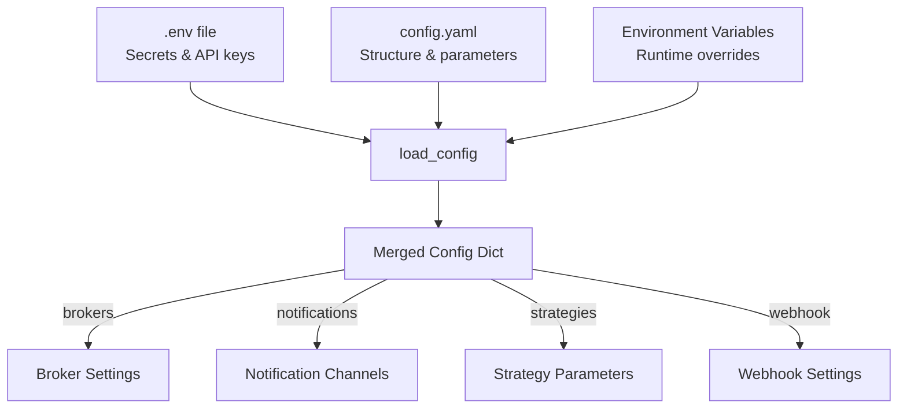

# System Architecture

## Overview

The stocks_plugin platform provides a unified codebase for developing, testing, and deploying trading automation across four major platforms: TradingView, thinkorswim, Interactive Brokers, and TradeStation.

---

## High-Level Architecture



---

## Module Dependency Graph



---

## Data Flow

### TradingView Alert → Order Execution



### IB Pairs Trading Bot Flow



---

## Configuration System



**Priority order** (highest wins):
1. Environment variables
2. `.env` file values
3. `config.yaml` values
4. Default values in code

---

## Notification System

The `AlertDispatcher` supports multi-channel notifications with independent fail-safety:

| Channel | Transport | Use Case |
|---------|-----------|----------|
| Console | stdout | Development, debugging |
| Discord | Webhook POST | Real-time trade alerts |
| Email | SMTP | Daily summaries, critical alerts |
| SMS | Twilio REST API | Critical alerts only |

**Priority Levels:**
- `INFO` — Trade executions, status updates
- `WARNING` — Margin warnings, unusual activity
- `CRITICAL` — System errors, max drawdown breached

Each channel is wrapped in an independent try/except — one channel failing does not block others.

---

## Backtesting Engine

The `BacktestEngine` provides a lightweight, platform-agnostic framework for strategy validation:

```
Input:  OHLCV DataFrame + Strategy Function
Output: BacktestResult (metrics + equity curve + trade log)
```

**Metrics computed:**
- Sharpe Ratio (annualized, √252)
- Sortino Ratio (downside deviation only)
- Maximum Drawdown (peak-to-trough)
- Win Rate (winning / total trades)
- Profit Factor (gross profit / gross loss)
- Total Return (%)
- Equity Curve (list of portfolio values)
- Trade Log (entry/exit price, P&L per trade)

---

## Directory Structure Summary

```
stocks_plugin/
├── shared/              # Foundation — config, notifications, backtesting
├── tradingview/         # Pine Script strategies + webhook server
├── thinkorswim/         # thinkScript studies, scans, watchlists
├── interactive_brokers/ # Python algo trading via TWS API
├── tradestation/        # EasyLanguage + REST API automation
├── docs/                # Architecture & platform guides
└── tests/               # Unit tests for Python modules
```

---

## Technology Stack

| Component | Technology | Purpose |
|-----------|-----------|---------|
| Webhook Server | FastAPI + Uvicorn | Async HTTP server for TradingView alerts |
| IB Connection | ib_async / ibapi | TWS API client libraries |
| TradeStation API | requests + OAuth2 | REST API client |
| Config | PyYAML + python-dotenv | Configuration management |
| Data Analysis | pandas + numpy | OHLCV data processing |
| Statistics | statsmodels + scipy | Cointegration tests, regression |
| Testing | pytest + pytest-asyncio | Unit and integration tests |
| Notifications | requests + smtplib | Multi-channel alerting |
