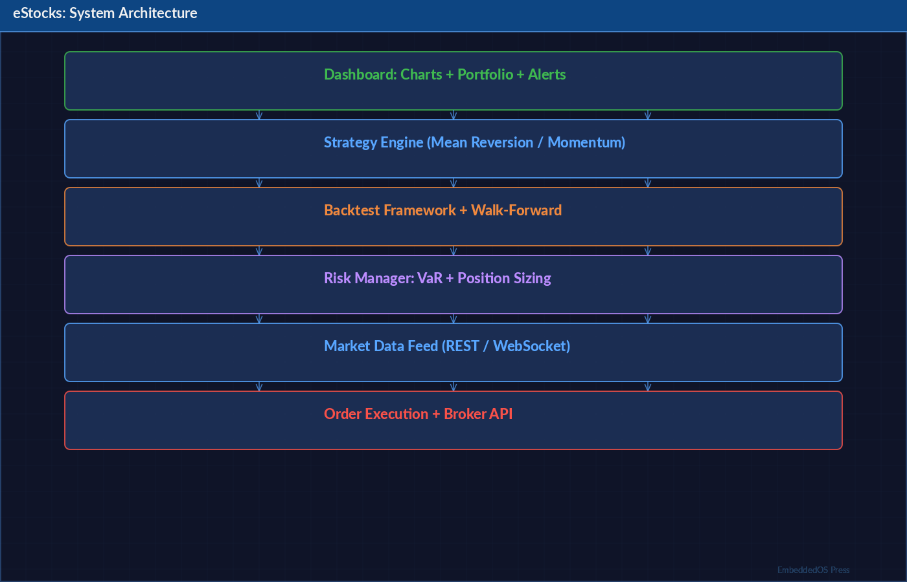
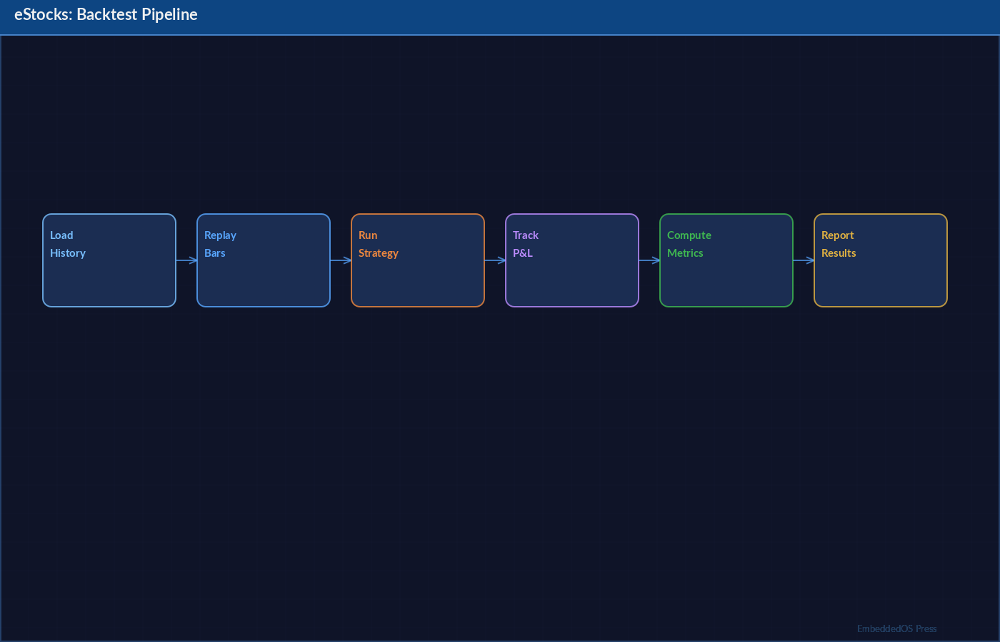

# eStocks Trading Scripts — Algorithmic Trading [@chan2013] System: Product Reference

**By Srikanth Patchava & EmbeddedOS Contributors**

**April 2026 — First Edition**

**EmbeddedOS Organization**

---

*Part of the EmbeddedOS Ecosystem*

*Version 2.0*

*Document Revision: 1.0.0*

---

## Copyright & License




Copyright © 2026 Srikanth Patchava & EmbeddedOS Contributors.
All rights reserved.

This document is provided as part of the eStocks Trading Scripts product
within the EmbeddedOS ecosystem. Redistribution and use in source and
documentation forms, with or without modification, are permitted provided
that the original copyright notice is retained.

---

## Table of Contents


- [Preface](#preface)
- [Chapter 1: Introduction](#chapter-1-introduction)
- [Chapter 2: Architecture Overview](#chapter-2-architecture-overview)
- [Chapter 3: The 15 Trading Strategies](#chapter-3-the-15-trading-strategies)
- [Chapter 4: 7-Layer Risk Management](#chapter-4-7-layer-risk-management)
- [Chapter 5: Data Sources and Enrichment](#chapter-5-data-sources-and-enrichment)
- [Chapter 6: Technical Indicators](#chapter-6-technical-indicators)
- [Chapter 7: Backtesting [@backtrader] Engine](#chapter-7-backtesting-engine)
- [Chapter 8: Machine Learning [@dePrado2018]](#chapter-8-machine-learning)
- [Chapter 9: Paper Trading](#chapter-9-paper-trading)
- [Chapter 10: TradingView Integration](#chapter-10-tradingview-integration)
- [Chapter 11: Interactive Brokers Integration](#chapter-11-interactive-brokers-integration)
- [Chapter 12: thinkorswim Integration](#chapter-12-thinkorswim-integration)
- [Chapter 13: TradeStation Integration](#chapter-13-tradestation-integration)
- [Chapter 14: Production Safety Controls](#chapter-14-production-safety-controls)
- [Chapter 15: Trade Journal and Psychology](#chapter-15-trade-journal-and-psychology)
- [Appendix A: Strategy Parameter Reference](#appendix-a-strategy-parameter-reference)
- [Appendix B: Indicator Reference](#appendix-b-indicator-reference)
- [Appendix C: Troubleshooting](#appendix-c-troubleshooting)
- [Glossary](#glossary)

---

# Preface

## Important Disclaimer

**RISK WARNING:** Trading stocks, options, and other financial instruments
involves substantial risk of loss and is not suitable for every investor.
The valuation of stocks and other securities may fluctuate, and as a result,
clients may lose more than their original investment. Past performance of a
security or strategy does not guarantee future results or success.

**This software is provided for educational and research purposes only.**
Nothing in this documentation or in the eStocks Trading Scripts software
constitutes financial advice, investment advice, trading advice, or any
other sort of advice. You should not treat any of the software's output
as a recommendation to buy, sell, or hold any financial instrument.

**No guarantee of profit.** Algorithmic trading systems, including this one,
can and do lose money. The 288+ tests, 7-layer risk management, and
production safety controls are designed to reduce risk, not eliminate it.
You are solely responsible for your trading decisions and their outcomes.

**Paper trade first.** We strongly recommend extensive paper trading before
committing real capital. Use the built-in `paper_trader.py` to validate
any strategy in simulated mode before live deployment.

## About This Book

This reference manual provides comprehensive documentation for the eStocks
Trading Scripts product, a component of the EmbeddedOS ecosystem. It covers
all 15 trading strategies, the 7-layer risk management system, data sources,
technical indicators, backtesting, machine learning integration, platform
integrations, and production safety controls.

The book is intended for:

- **Developers** extending or customizing the trading system
- **Traders** configuring strategies and risk parameters
- **Researchers** backtesting and validating new approaches
- **System administrators** deploying production trading infrastructure

## Conventions Used in This Book

- `monospace` — Code samples, file paths, command-line input
- **Bold** — Important terms, key concepts
- *Italic* — Emphasis, first use of a technical term
- `>>>` — Python REPL examples
- `$` — Shell command prompt

---

# Chapter 1: Introduction

## 1.1 Vision

The eStocks Trading Scripts project was born from a simple observation:
most retail traders lack access to the institutional-grade tools that
professional quantitative firms use daily. Our mission is to democratize
algorithmic trading by providing a comprehensive, tested, and production-ready
trading system that anyone can deploy, extend, and customize.

eStocks is not a black box. Every strategy is transparent, every risk
parameter is configurable, and every signal is explainable. We believe
that understanding *why* a trade is taken is just as important as
taking the trade itself.

## 1.2 What eStocks Provides

The eStocks Trading Scripts system delivers:

- **15 Complete Trading Strategies** — From classic trend-following to
  cutting-edge deep learning, each strategy is fully implemented with
  entry signals, exit signals, position sizing, and risk controls.

- **7 Data Sources** — Price, Volume, Fundamentals, News Sentiment,
  Earnings Calendar, Machine Learning predictions, and Market Regime
  detection feed into every strategy through the Strategy Enricher.

- **7-Layer Risk Management** — Defense-in-depth risk controls from
  per-trade risk limits to portfolio [@markowitz1952]-wide circuit breakers ensure
  that no single failure can cause catastrophic loss.

- **288+ Automated Tests** — Comprehensive test coverage including
  unit tests, integration tests, strategy validation, and edge case
  testing with thread safety verification.

- **4 Platform Integrations** — TradingView, thinkorswim,
  Interactive Brokers, and TradeStation are all supported with
  native code implementations.

- **Production Safety Controls** — Fat-finger protection, price
  deviation checks, short selling limits, liquidity filters, market
  hours enforcement, and crash-recoverable state persistence.

## 1.3 Quick Start

Getting started with eStocks takes three commands:

```bash
# Step 1: Install dependencies, validate environment, test connectivity
python setup_trading.py

# Step 2: Paper trade specific symbols with a strategy
python paper_trader.py --symbols AAPL,MSFT,GOOGL --strategy meta_ensemble

# Step 3: Scan the full universe with all strategies
python paper_trader.py --scan-universe
```

The `setup_trading.py` script handles all dependency installation,
environment validation, API connectivity testing, and initial
configuration. It produces a detailed report of what was configured
and any issues encountered.

## 1.4 Design Philosophy

The eStocks system is built on five core principles:

1. **Transparency** — Every signal, every decision, every risk check
   is logged and explainable. No black boxes.

2. **Defense in Depth** — Multiple independent layers of risk
   management ensure that no single point of failure can cause
   catastrophic loss.

3. **Test Everything** — With 288+ automated tests, we verify every
   strategy, every indicator, every risk check, and every edge case.

4. **Thread Safety** — All state management uses SQLite WAL mode
   with proper locking for safe concurrent access.

5. **Fail Safe** — When in doubt, the system refuses to trade.
   Circuit breakers, cooldowns, and hard limits ensure that
   errors result in stopped trading, not runaway losses.

## 1.5 Supported Python Versions

eStocks is tested across a CI/CD matrix covering:

- Python 3.10
- Python 3.11
- Python 3.12

The CI pipeline includes Bandit security scanning, flake8 linting,
strategy validation tests, and automated GitHub release on tags.

---

# Chapter 2: Architecture Overview

## 2.1 System Architecture

The eStocks system follows a layered architecture with clear separation
of concerns:

```
┌─────────────────────────────────────────────────────────────────┐
│                    PRESENTATION LAYER                           │
│  ┌──────────┐ ┌──────────┐ ┌──────────┐ ┌──────────────────┐  │
│  │TradingView│ │   tOS    │ │   IB     │ │  TradeStation    │  │
│  │Pine Script│ │thinkScript│ │ TWS API │ │  EasyLanguage    │  │
│  └────┬─────┘ └────┬─────┘ └────┬─────┘ └───────┬──────────┘  │
│       │             │            │                │             │
├───────┼─────────────┼────────────┼────────────────┼─────────────┤
│       └─────────────┴──────┬─────┴────────────────┘             │
│                    STRATEGY LAYER                                │
│  ┌─────────────────────────────────────────────────────────┐    │
│  │              15 Trading Strategies                       │    │
│  │  trend | breakout | mean_rev | factor | darvas | triple  │    │
│  │  canslim | value | ml | rl | self_learn | sentiment      │    │
│  │  earnings | sector_rotation | meta_ensemble              │    │
│  └──────────────────────┬──────────────────────────────────┘    │
│                         │                                       │
├─────────────────────────┼───────────────────────────────────────┤
│                    ENRICHMENT LAYER                              │
│  ┌──────────────────────┴──────────────────────────────────┐    │
│  │              Strategy Enricher                           │    │
│  │  Price | Volume | Fundamentals | News | Earnings         │    │
│  │  ML Predictions | Market Regime                          │    │
│  └──────────────────────┬──────────────────────────────────┘    │
│                         │                                       │
├─────────────────────────┼───────────────────────────────────────┤
│                    RISK MANAGEMENT LAYER                        │
│  ┌──────────────────────┴──────────────────────────────────┐    │
│  │              7-Layer Risk Manager                        │    │
│  │  L7:Portfolio | L6:Position | L5:Circuit | L4:Monthly    │    │
│  │  L3:Daily | L2:Cooldown | L1:Per-Trade                   │    │
│  └──────────────────────┬──────────────────────────────────┘    │
│                         │                                       │
├─────────────────────────┼───────────────────────────────────────┤
│                    DATA LAYER                                   │
│  ┌──────────────────────┴──────────────────────────────────┐    │
│  │         Public Data Fetcher + Indicators                 │    │
│  │  35+ Technical Indicators | 14 Candlestick Patterns      │    │
│  │  SQLite WAL State | Trade Journal                        │    │
│  └─────────────────────────────────────────────────────────┘    │
│                                                                 │
├─────────────────────────────────────────────────────────────────┤
│                    INFRASTRUCTURE LAYER                         │
│  ┌─────────────────────────────────────────────────────────┐    │
│  │  Backtesting Engine | ML Models | CI/CD Pipeline         │    │
│  │  288+ Tests | Thread Safety | Crash Recovery             │    │
│  └─────────────────────────────────────────────────────────┘    │
└─────────────────────────────────────────────────────────────────┘
```

## 2.2 Directory Structure

```
eStocks_Trading_Scripts/
├── stocks_plugin/
│   ├── shared/
│   │   ├── risk_manager.py          # 7-layer risk management
│   │   ├── strategy_enricher.py     # Multi-source data enrichment
│   │   ├── trade_journal.py         # Trade logging & psychology
│   │   ├── data/
│   │   │   └── public_data_fetcher.py  # Market data retrieval
│   │   ├── indicators/
│   │   │   ├── technical.py         # 35+ technical indicators
│   │   │   └── candlestick.py       # 14 candlestick patterns
│   │   ├── backtesting/
│   │   │   └── multi_asset_backtester.py
│   │   └── ml/
│   │       ├── lstm_model.py        # LSTM deep learning
│   │       ├── rl_agent.py          # PPO reinforcement learning
│   │       ├── sentiment.py         # NLP sentiment analysis
│   │       └── regime_detector.py   # Market regime detection
│   ├── strategies/
│   │   └── examples/
│   │       ├── trend_following.py
│   │       ├── breakout.py
│   │       ├── mean_reversion.py
│   │       ├── factor.py
│   │       ├── darvas_box.py
│   │       ├── triple_screen.py
│   │       ├── canslim.py
│   │       ├── value.py
│   │       ├── ml_strategy.py
│   │       ├── rl_strategy.py
│   │       ├── self_learning.py
│   │       ├── sentiment.py
│   │       ├── earnings.py
│   │       ├── sector_rotation.py
│   │       └── meta_ensemble.py
│   └── tests/
│       └── (288+ test files)
├── tradingview/
│   ├── strategies/
│   ├── indicators/
│   ├── scanners/
│   └── webhooks/
├── thinkorswim/
│   ├── strategies/
│   ├── studies/
│   ├── scans/
│   └── watchlists/
├── interactive_brokers/
│   ├── strategies/
│   ├── data/
│   ├── analytics/
│   └── utils/
├── tradestation/
│   ├── strategies/
│   ├── indicators/
│   ├── scanners/
│   └── api/
├── shared/
│   ├── config/
│   ├── notifier/
│   └── backtesting/
├── setup_trading.py
├── paper_trader.py
└── tests/
```

## 2.3 Data Flow

The data flow through the system follows a strict pipeline:

```
Market Data APIs ──→ Public Data Fetcher ──→ Technical Indicators
                                                     │
                                                     ▼
News APIs ──→ Sentiment Analyzer ──→ Strategy Enricher
Earnings APIs ──────────────────────────┘    │
ML Models ──────────────────────────────────┘
Regime Detector ────────────────────────────┘
                                                     │
                                                     ▼
                                              Trading Strategy
                                                     │
                                                     ▼
                                              Risk Manager
                                              (7 Layers)
                                                     │
                                              ┌──────┴──────┐
                                              │  APPROVED?   │
                                              ├──────┬───────┤
                                              │ YES  │  NO   │
                                              │      │       │
                                              ▼      ▼       │
                                          Execute  Log &     │
                                           Order   Skip      │
                                              │               │
                                              ▼               │
                                         Trade Journal ◄──────┘
```

## 2.4 Component Interactions

Each component communicates through well-defined interfaces:

1. **Public Data Fetcher** provides OHLCV data and fundamentals
2. **Strategy Enricher** combines all 7 data sources into a unified context
3. **Strategies** consume enriched data and produce signals
4. **Risk Manager** validates signals against all 7 layers
5. **Trade Journal** records all decisions for analysis
6. **Paper Trader** orchestrates the full pipeline in simulation

## 2.5 Threading Model

The eStocks system uses a multi-threaded architecture for concurrent
operations:

- **Main Thread** — Strategy orchestration, signal generation
- **Data Thread** — Asynchronous data fetching and caching
- **Risk Thread** — Independent risk monitoring and circuit breakers
- **Journal Thread** — Non-blocking trade logging

All shared state is managed through SQLite WAL mode, which provides
concurrent read access with serialized writes. Busy timeouts prevent
deadlocks, and the WAL journal enables crash recovery.

---

# Chapter 3: The 15 Trading Strategies

## 3.1 Overview

Every strategy in eStocks follows a common interface:

```python
class TradingStrategy:
    def generate_signal(self, enriched_data: dict) -> Signal:
        """Produce BUY, SELL, or HOLD signal with confidence."""
        pass

    def calculate_position_size(self, signal: Signal, equity: float) -> int:
        """Determine number of shares based on risk parameters."""
        pass
```

All 15 strategies consume the same enriched data context containing
Price, Volume, Fundamentals, News, Earnings, ML predictions, and
Market Regime information.

## 3.2 Strategy 1: Trend Following

**File:** `strategies/examples/trend_following.py`

The trend following strategy uses Exponential Moving Average (EMA)
crossovers confirmed by the Average Directional Index (ADX) with
a trailing stop for exit management.

**Signal Logic:**

- **BUY:** Fast EMA (12) crosses above Slow EMA (26) AND ADX > 25
- **SELL:** Fast EMA crosses below Slow EMA OR trailing stop hit
- **HOLD:** No crossover or ADX < 25 (weak trend)

**Key Parameters:**

| Parameter | Default | Range | Description |
|-----------|---------|-------|-------------|
| fast_ema | 12 | 5-20 | Fast EMA period |
| slow_ema | 26 | 20-50 | Slow EMA period |
| adx_threshold | 25 | 20-30 | Minimum ADX for trend confirmation |
| trailing_stop_pct | 0.05 | 0.02-0.10 | Trailing stop percentage |
| atr_multiplier | 2.0 | 1.5-3.0 | ATR-based stop distance |

**How It Works:**

1. Calculate 12-period and 26-period EMAs on closing prices
2. Compute ADX using 14-period DI+ and DI- components
3. When fast EMA crosses above slow EMA with ADX > 25, generate BUY
4. Set trailing stop at entry price minus (ATR × multiplier)
5. Update trailing stop upward as price advances
6. Exit when price hits trailing stop or fast EMA crosses below slow EMA

**Best Market Conditions:** Strong trending markets with clear
directional momentum. Underperforms in choppy, range-bound markets.

## 3.3 Strategy 2: Breakout

**File:** `strategies/examples/breakout.py`

The breakout strategy identifies Donchian Channel breakouts —
price moves above the highest high or below the lowest low of
a defined lookback period.

**Signal Logic:**

- **BUY:** Price closes above the 20-period highest high
- **SELL:** Price closes below the 10-period lowest low
- **HOLD:** Price within the channel

**Key Parameters:**

| Parameter | Default | Range | Description |
|-----------|---------|-------|-------------|
| entry_period | 20 | 10-55 | Donchian channel entry period |
| exit_period | 10 | 5-20 | Donchian channel exit period |
| volume_confirm | 1.5 | 1.2-2.0 | Volume multiple for confirmation |
| atr_filter | 1.0 | 0.5-2.0 | Minimum ATR for volatility filter |

**How It Works:**

1. Calculate the highest high over the entry period (default 20 bars)
2. Calculate the lowest low over the exit period (default 10 bars)
3. When close exceeds the upper channel with volume confirmation, BUY
4. When close drops below the lower channel, SELL
5. Apply ATR filter to avoid breakouts in very low volatility

**Best Market Conditions:** Markets transitioning from low volatility
consolidation to trending moves. Works well with the Turtle Trading
system philosophy.

## 3.4 Strategy 3: Mean Reversion

**File:** `strategies/examples/mean_reversion.py`

Mean reversion trades the assumption that prices revert to their
statistical mean. It combines RSI for overbought/oversold detection
with Bollinger Bands for price envelope context.

**Signal Logic:**

- **BUY:** RSI < 30 AND price below lower Bollinger Band
- **SELL:** RSI > 70 AND price above upper Bollinger Band
- **HOLD:** RSI between 30-70 or price within bands

**Key Parameters:**

| Parameter | Default | Range | Description |
|-----------|---------|-------|-------------|
| rsi_period | 14 | 7-21 | RSI calculation period |
| rsi_oversold | 30 | 20-35 | RSI oversold threshold |
| rsi_overbought | 70 | 65-80 | RSI overbought threshold |
| bb_period | 20 | 15-25 | Bollinger Band period |
| bb_std | 2.0 | 1.5-2.5 | Bollinger Band std deviations |

**Best Market Conditions:** Range-bound, sideways markets where
prices oscillate between support and resistance. Dangerous in
strong trending markets where prices deviate from mean for extended
periods.

## 3.5 Strategy 4: Factor (Momentum)

**File:** `strategies/examples/factor.py`

The factor strategy implements the classic 12-1 month cross-sectional
momentum strategy: long the top decile of 12-month winners (excluding
the most recent month) and short the bottom decile.

**Signal Logic:**

- **LONG:** Stock in top 10% of 12-1 month returns
- **SHORT:** Stock in bottom 10% of 12-1 month returns
- **HOLD:** Stock in middle 80%

**Key Parameters:**

| Parameter | Default | Range | Description |
|-----------|---------|-------|-------------|
| lookback_months | 12 | 6-18 | Momentum lookback period |
| skip_months | 1 | 1-2 | Recent months to skip (reversal avoidance) |
| long_pct | 0.10 | 0.05-0.20 | Top percentile for longs |
| short_pct | 0.10 | 0.05-0.20 | Bottom percentile for shorts |
| rebalance_freq | monthly | weekly-quarterly | Rebalance frequency |

**Academic Basis:** Based on Jegadeesh & Titman (1993) momentum factor,
one of the most robust anomalies in financial literature. The skip-month
avoids the well-documented short-term reversal effect.

## 3.6 Strategy 5: Darvas Box

**File:** `strategies/examples/darvas_box.py`

Nicolas Darvas's box theory identifies stocks making new highs and
forming consolidation "boxes." A breakout above the box top triggers
a buy, while a break below the box bottom triggers a sell.

**Signal Logic:**

- **BUY:** Price breaks above the established box top on volume
- **SELL:** Price breaks below the box bottom
- **HOLD:** Price consolidating within the box

**Key Parameters:**

| Parameter | Default | Range | Description |
|-----------|---------|-------|-------------|
| box_period | 20 | 10-30 | Bars to establish box boundaries |
| volume_surge | 2.0 | 1.5-3.0 | Volume multiple for breakout |
| new_high_lookback | 52 | 20-100 | Period for new high detection |
| stop_loss_pct | 0.05 | 0.03-0.08 | Stop loss below box bottom |

**Historical Note:** Nicolas Darvas was a dancer who turned $10,000 into
over $2 million in the 1950s using this method, documented in his book
"How I Made $2,000,000 in the Stock Market."

## 3.7 Strategy 6: Triple Screen

**File:** `strategies/examples/triple_screen.py`

Alexander Elder's Triple Screen system uses three timeframes to
filter trades through multiple confirmation layers:

1. **Screen 1 (Weekly):** Identify the tide — overall trend direction
2. **Screen 2 (Daily):** Identify the wave — pullback in trend direction
3. **Screen 3 (Intraday):** Identify the ripple — precise entry timing

**Signal Logic:**

- **BUY:** Weekly trend UP + Daily oscillator oversold + Intraday buy stop hit
- **SELL:** Weekly trend DOWN + Daily oscillator overbought + Intraday sell stop hit

**Key Parameters:**

| Parameter | Default | Range | Description |
|-----------|---------|-------|-------------|
| weekly_ema | 26 | 13-52 | Weekly EMA for trend |
| daily_force_index | 2 | 2-13 | Daily Force Index period |
| stoch_oversold | 30 | 20-35 | Stochastic oversold level |
| stoch_overbought | 70 | 65-80 | Stochastic overbought level |
| trail_stop_atr | 2.0 | 1.5-3.0 | ATR trailing stop multiplier |

## 3.8 Strategy 7: CAN SLIM

**File:** `strategies/examples/canslim.py`

William O'Neil's CAN SLIM system scores stocks on 7 fundamental
and technical criteria:

| Letter | Criterion | Description |
|--------|-----------|-------------|
| C | Current Earnings | Quarterly EPS growth >= 25% |
| A | Annual Earnings | 5-year annual EPS growth >= 25% |
| N | New Product/High | New catalyst or 52-week high |
| S | Supply & Demand | Low float + high volume |
| L | Leader or Laggard | RS Rating >= 80 |
| I | Institutional Sponsorship | Increasing fund ownership |
| M | Market Direction | Major indices in confirmed uptrend |

**Signal Logic:**

- **BUY:** Score >= 5 out of 7 criteria met AND market in uptrend
- **SELL:** Score drops below 3 OR market in correction
- **HOLD:** Score between 3-5

**Key Parameters:**

| Parameter | Default | Range | Description |
|-----------|---------|-------|-------------|
| min_eps_growth | 0.25 | 0.15-0.40 | Min quarterly EPS growth |
| min_annual_growth | 0.25 | 0.15-0.40 | Min annual EPS growth |
| min_rs_rating | 80 | 70-90 | Min relative strength rating |
| min_criteria | 5 | 4-7 | Min criteria to pass |

## 3.9 Strategy 8: Value (Graham)

**File:** `strategies/examples/value.py`

Benjamin Graham's fundamental value approach screens for stocks
trading below intrinsic value with a margin of safety.

**Screening Criteria:**

- P/E ratio below industry median
- Price-to-Book ratio < 1.5
- Current ratio > 2.0
- Positive earnings for past 5 years
- Dividend history >= 10 years
- Earnings growth >= 33% over 10 years
- Market cap > $2 billion (adjusted for inflation)

**Key Parameters:**

| Parameter | Default | Range | Description |
|-----------|---------|-------|-------------|
| max_pe | 15.0 | 10-20 | Maximum P/E ratio |
| max_pb | 1.5 | 1.0-2.0 | Maximum P/B ratio |
| min_current_ratio | 2.0 | 1.5-2.5 | Minimum current ratio |
| margin_of_safety | 0.33 | 0.25-0.50 | Required discount to intrinsic value |
| min_div_years | 10 | 5-20 | Minimum years of dividends |

**Intrinsic Value Calculation:**

```
Intrinsic Value = EPS x (8.5 + 2g) x (4.4 / Y)

Where:
  EPS = Current earnings per share
  g   = Expected annual growth rate (%)
  Y   = Current yield on AAA corporate bonds (%)
  8.5 = P/E base for a zero-growth company (Graham's estimate)
```

## 3.10 Strategy 9: Machine Learning (LSTM)

**File:** `strategies/examples/ml_strategy.py`

The ML strategy uses a Long Short-Term Memory (LSTM) neural network
to predict price direction. The model is trained on historical
sequences of enriched features including technical indicators,
volume patterns, and sentiment scores.

**Architecture:**

```
Input (60 timesteps x 45 features)
    |
    v
LSTM Layer 1 (128 units, return_sequences=True)
    |
    v
Dropout (0.2)
    |
    v
LSTM Layer 2 (64 units)
    |
    v
Dropout (0.2)
    |
    v
Dense (32 units, ReLU)
    |
    v
Dense (3 units, Softmax) -> [DOWN, NEUTRAL, UP]
```

**Key Parameters:**

| Parameter | Default | Range | Description |
|-----------|---------|-------|-------------|
| sequence_length | 60 | 30-120 | Input sequence length (bars) |
| lstm_units_1 | 128 | 64-256 | First LSTM layer units |
| lstm_units_2 | 64 | 32-128 | Second LSTM layer units |
| dropout_rate | 0.2 | 0.1-0.4 | Dropout regularization rate |
| confidence_threshold | 0.65 | 0.55-0.80 | Minimum prediction confidence |
| retrain_interval | 30 | 7-90 | Days between model retraining |

## 3.11 Strategy 10: Reinforcement Learning (PPO)

**File:** `strategies/examples/rl_strategy.py`

The RL strategy uses Proximal Policy Optimization (PPO) to learn
an optimal trading policy through interaction with historical
market environments.

**State Space:**
- Current position (long/flat/short)
- Unrealized P&L
- Account equity
- 20 technical indicators
- Sentiment score
- Market regime

**Action Space:**
- BUY (go long or add to position)
- SELL (go short or reduce position)
- HOLD (maintain current position)

**Reward Function:**
- Realized P&L per trade
- Risk-adjusted returns (Sharpe-like)
- Penalty for excessive trading (commission drag)
- Penalty for large drawdowns

**Key Parameters:**

| Parameter | Default | Range | Description |
|-----------|---------|-------|-------------|
| learning_rate | 3e-4 | 1e-4 to 1e-3 | PPO learning rate |
| clip_ratio | 0.2 | 0.1-0.3 | PPO clipping parameter |
| gamma | 0.99 | 0.95-0.999 | Discount factor |
| episodes | 1000 | 500-5000 | Training episodes |
| entropy_coef | 0.01 | 0.005-0.05 | Entropy bonus coefficient |

## 3.12 Strategy 11: Self-Learning

**File:** `strategies/examples/self_learning.py`

The self-learning strategy is an adaptive ML ensemble that
continuously evaluates and reweights its component models based
on recent performance. It combines predictions from multiple
sub-models and adjusts their influence dynamically.

**Component Models:**

1. Linear regression on momentum features
2. Random forest classifier on technical signals
3. Gradient boosted trees on fundamental scores
4. LSTM on price sequences
5. Sentiment model on news data

**Adaptation Mechanism:**

- Rolling window performance evaluation (last 20 trades)
- Exponential decay weighting of model predictions
- Models with recent accuracy > 55% receive increased weight
- Models below 45% accuracy are temporarily muted
- Full ensemble rebalance every 5 trading days

## 3.13 Strategy 12: Sentiment

**File:** `strategies/examples/sentiment.py`

The sentiment strategy combines natural language processing of
news articles with technical analysis for trade decisions.

**Signal Logic:**

- **BUY:** Composite sentiment > +0.3 AND technical confirmation
- **SELL:** Composite sentiment < -0.3 AND technical confirmation
- **HOLD:** Sentiment between -0.3 and +0.3 or no technical confirmation

**Sentiment Sources:**

- Financial news headlines (weighted 0.4)
- Social media mentions (weighted 0.2)
- Analyst ratings changes (weighted 0.3)
- Insider trading filings (weighted 0.1)

**Key Parameters:**

| Parameter | Default | Range | Description |
|-----------|---------|-------|-------------|
| positive_threshold | 0.3 | 0.2-0.5 | Bullish sentiment threshold |
| negative_threshold | -0.3 | -0.5 to -0.2 | Bearish sentiment threshold |
| headline_weight | 0.4 | 0.2-0.6 | News headline weight |
| social_weight | 0.2 | 0.1-0.3 | Social media weight |
| analyst_weight | 0.3 | 0.2-0.4 | Analyst rating weight |
| insider_weight | 0.1 | 0.05-0.2 | Insider filing weight |

## 3.14 Strategy 13: Earnings

**File:** `strategies/examples/earnings.py`

The earnings strategy trades around quarterly earnings
announcements, exploiting the well-documented post-earnings
announcement drift (PEAD).

**Signal Logic:**

- **Pre-Earnings BUY:** 5 days before earnings if historical beat
  rate > 70% and positive sentiment
- **Post-Earnings BUY:** After positive surprise > 10% with volume surge
- **SELL:** After negative surprise or if position held > 10 days post-earnings

**Key Parameters:**

| Parameter | Default | Range | Description |
|-----------|---------|-------|-------------|
| pre_earnings_days | 5 | 3-10 | Days before earnings to enter |
| min_beat_rate | 0.70 | 0.60-0.80 | Historical beat rate threshold |
| surprise_threshold | 0.10 | 0.05-0.20 | Minimum EPS surprise for entry |
| max_hold_days | 10 | 5-20 | Maximum days to hold post-earnings |
| volume_surge | 2.0 | 1.5-3.0 | Volume multiple confirmation |

## 3.15 Strategy 14: Sector Rotation

**File:** `strategies/examples/sector_rotation.py`

The sector rotation strategy allocates capital to the strongest
sector ETFs based on relative momentum, rotating monthly.

**Tracked Sectors (ETFs):**

| ETF | Sector |
|-----|--------|
| XLK | Technology |
| XLF | Financials |
| XLV | Healthcare |
| XLE | Energy |
| XLI | Industrials |
| XLP | Consumer Staples |
| XLY | Consumer Discretionary |
| XLU | Utilities |
| XLB | Materials |
| XLRE | Real Estate |
| XLC | Communications |

**Signal Logic:**

1. Calculate 3-month and 6-month momentum for each sector
2. Rank sectors by composite momentum score
3. Go long top 3 sectors, short bottom 2 sectors
4. Rebalance monthly on the first trading day

**Key Parameters:**

| Parameter | Default | Range | Description |
|-----------|---------|-------|-------------|
| momentum_3m_weight | 0.5 | 0.3-0.7 | 3-month momentum weight |
| momentum_6m_weight | 0.5 | 0.3-0.7 | 6-month momentum weight |
| top_sectors | 3 | 2-5 | Number of long sectors |
| bottom_sectors | 2 | 1-3 | Number of short sectors |
| rebalance_day | 1 | 1-5 | Day of month to rebalance |

## 3.16 Strategy 15: Meta Ensemble

**File:** `strategies/examples/meta_ensemble.py`

The meta ensemble is the master strategy that combines signals
from all other strategies using a weighted voting system.

**Ensemble Method:**

1. Collect signals from all 14 sub-strategies
2. Weight each signal by the strategy's recent Sharpe ratio
3. Apply confidence-weighted voting
4. Generate final signal only when weighted consensus > 60%
5. Position size based on consensus strength

**Key Parameters:**

| Parameter | Default | Range | Description |
|-----------|---------|-------|-------------|
| min_consensus | 0.60 | 0.50-0.75 | Minimum weighted agreement |
| lookback_sharpe | 60 | 30-120 | Days for Sharpe calculation |
| max_strategies | 14 | 5-14 | Max strategies to include |
| dynamic_weights | True | True/False | Enable adaptive weighting |
| reweight_freq | 5 | 1-20 | Days between weight updates |

**Why Meta Ensemble Works:**

The meta ensemble exploits the fact that different strategies excel
in different market conditions. By dynamically weighting strategies
based on recent performance, the ensemble adapts to the current
market regime automatically. When trend-following strategies are
performing well (trending market), they receive higher weight.
When mean reversion strategies lead (range-bound market), they
dominate the ensemble. This creates a system that is more robust
than any individual strategy.

---

# Chapter 4: 7-Layer Risk Management

## 4.1 Overview

The risk management system implements a defense-in-depth approach
with 7 independent layers. Each layer operates independently, and
a trade must pass ALL layers to be executed. This ensures that
no single point of failure can result in catastrophic loss.

**File:** `shared/risk_manager.py`

```
Trade Signal
    |
    v
+----------------------------+
| Layer 7: Portfolio Heat    | --> REJECT if > 20% equity at risk
+----------------------------+
| Layer 6: Position Cap      | --> REJECT if > 25% equity in one name
+----------------------------+
| Layer 5: Circuit Breaker   | --> REJECT if 10% drawdown (24h pause)
+----------------------------+
| Layer 4: Monthly Cap       | --> REJECT if 6% monthly loss reached
+----------------------------+
| Layer 3: Daily Limit       | --> REJECT if $5,000 daily loss reached
+----------------------------+
| Layer 2: Cooldown          | --> REJECT if 3 consecutive losses < 30 min
+----------------------------+
| Layer 1: Per-Trade Risk    | --> REJECT if > 2% equity risk per trade
+----------------------------+
    |
    v
  APPROVED -> Execute Trade
```

## 4.2 Layer 7: Portfolio Heat

**Purpose:** Prevent total portfolio exposure from becoming excessive.

**Rule:** Maximum 20% of total equity may be at risk at any time.
"At risk" is defined as the sum of (position size x stop distance)
for all open positions.

**Configuration:**

```python
risk_config = {
    "portfolio_heat_max": 0.20,  # 20% maximum portfolio heat
    "heat_calculation": "stop_based",  # Based on stop-loss distances
    "include_unrealized": True,  # Include unrealized P&L in equity
}
```

**Example:**
- Portfolio equity: $100,000
- Maximum heat: $20,000
- Position A: 100 shares x $2 stop distance = $200 at risk
- Position B: 500 shares x $5 stop distance = $2,500 at risk
- Current heat: $2,700 (2.7%) -- well within limit

## 4.3 Layer 6: Position Cap

**Purpose:** Prevent excessive concentration in any single position.

**Rules:**
- Maximum 25% of equity in any single position
- Maximum 10,000 shares per position
- Applies to both long and short positions

**Configuration:**

```python
risk_config = {
    "max_position_pct": 0.25,    # 25% of equity per position
    "max_shares": 10000,         # Hard share limit
    "max_position_value": None,  # Optional dollar cap (auto-calculated)
}
```

## 4.4 Layer 5: Circuit Breaker

**Purpose:** Halt all trading when drawdown exceeds a threshold,
preventing emotional revenge trading and allowing time for analysis.

**Rules:**
- If drawdown from peak equity reaches 10%, halt ALL trading
- Trading remains halted for 24 hours
- Automatic resume after cooldown period
- Manual override available for emergency situations

**Configuration:**

```python
risk_config = {
    "circuit_breaker_pct": 0.10,     # 10% drawdown threshold
    "circuit_breaker_hours": 24,     # Hours to remain halted
    "auto_resume": True,             # Automatically resume after period
    "notify_on_trigger": True,       # Send notification when triggered
}
```

**Circuit Breaker State Machine:**

```
NORMAL --(drawdown >= 10%)--> TRIGGERED
   ^                              |
   |                        (24 hours)
   |                              |
   +------(timer expired)------ COOLDOWN
```

## 4.5 Layer 4: Monthly Loss Cap

**Purpose:** Implement Elder's 6% monthly loss limit to prevent
a single bad month from devastating the portfolio.

**Rules:**
- If realized losses in the current calendar month exceed 6% of
  starting monthly equity, halt trading for the rest of the month
- Unrealized losses are tracked but don't trigger the cap
- Resets on the first trading day of each month

**Configuration:**

```python
risk_config = {
    "monthly_loss_cap_pct": 0.06,    # 6% monthly loss limit
    "cap_includes_unrealized": False, # Only realized losses count
    "auto_resume_new_month": True,   # Auto-resume on new month
}
```

## 4.6 Layer 3: Daily Loss Limit

**Purpose:** Hard daily stop to prevent catastrophic single-day losses.

**Rules:**
- If daily realized losses reach $5,000, halt all trading
- Resets at market open each day
- Separate from the monthly cap (both apply independently)

**Configuration:**

```python
risk_config = {
    "daily_loss_limit": 5000.00,     # $5,000 daily hard stop
    "daily_reset_time": "09:30",     # Reset at market open (ET)
    "include_commissions": True,     # Include trading costs
}
```

## 4.7 Layer 2: Cooldown

**Purpose:** Prevent tilt trading after consecutive losses by
enforcing a mandatory pause.

**Rules:**
- After 3 consecutive losing trades, enforce a 30-minute pause
- Cooldown resets after a winning trade
- Consecutive loss counter resets at end of trading day

**Configuration:**

```python
risk_config = {
    "consecutive_loss_limit": 3,     # Losses before cooldown
    "cooldown_minutes": 30,          # Cooldown duration
    "reset_daily": True,             # Reset counter daily
}
```

## 4.8 Layer 1: Per-Trade Risk

**Purpose:** Ensure no single trade can risk more than a small
percentage of total equity.

**Rules:**
- Maximum 2% of equity at risk per trade
- Risk is defined as: shares x (entry price - stop price)
- Position size is calculated to meet this constraint

**Calculation:**

```python
def calculate_position_size(equity, entry_price, stop_price, risk_pct=0.02):
    risk_per_share = abs(entry_price - stop_price)
    max_risk = equity * risk_pct
    shares = int(max_risk / risk_per_share)
    return min(shares, 10000)  # Layer 6 cap
```

**Example:**
- Equity: $100,000
- Entry: $150.00, Stop: $145.00
- Risk per share: $5.00
- Max risk (2%): $2,000
- Position size: 400 shares ($60,000 position)

## 4.9 Risk Layer Interaction

The layers interact in a cascading fashion. Outer layers (higher
numbers) are checked first, as they represent portfolio-wide
constraints. If any layer rejects, the trade is blocked without
checking remaining layers. This provides efficient early rejection
and prevents unnecessary computation.

**Rejection priority order:**
1. Portfolio Heat (L7) -- broadest scope
2. Position Cap (L6) -- single-position scope
3. Circuit Breaker (L5) -- system-wide halt
4. Monthly Cap (L4) -- calendar-based
5. Daily Limit (L3) -- intraday
6. Cooldown (L2) -- short-term behavioral
7. Per-Trade Risk (L1) -- narrowest scope

---

# Chapter 5: Data Sources and Enrichment

## 5.1 The 7 Data Sources

Every strategy in eStocks has access to 7 independent data sources,
combined through the Strategy Enricher:

### 5.1.1 Price Data

Historical and real-time OHLCV (Open, High, Low, Close, Volume) data.
This is the foundation of all technical analysis.

- **Source:** `public_data_fetcher.py`
- **Frequency:** 1-minute to monthly bars
- **History:** Up to 20 years for daily data
- **Fields:** open, high, low, close, volume, adjusted_close

### 5.1.2 Volume Data

Volume analysis beyond simple OHLCV, including:

- Volume-weighted average price (VWAP)
- On-balance volume (OBV)
- Volume rate of change
- Relative volume (vs. 20-day average)
- Volume profile (price-at-volume)

### 5.1.3 Fundamentals

Company financial data including:

- Income statement (revenue, EPS, margins)
- Balance sheet (assets, liabilities, equity)
- Cash flow statement
- Valuation ratios (P/E, P/B, P/S, EV/EBITDA)
- Growth rates (revenue, earnings, dividends)
- Industry comparisons

### 5.1.4 News Sentiment

NLP-processed news and social media sentiment:

- Headline sentiment scores (-1.0 to +1.0)
- Article body sentiment analysis
- Named entity recognition for company mentions
- Social media buzz score
- Analyst rating changes
- Composite sentiment indicator

### 5.1.5 Earnings Calendar

Quarterly earnings announcement data:

- Next earnings date
- Historical EPS estimates vs. actuals
- Earnings surprise percentage
- Whisper number (when available)
- Revenue estimates
- Guidance trends

### 5.1.6 ML Predictions

Machine learning model outputs:

- LSTM price direction probability
- PPO agent action recommendation
- Self-learning ensemble prediction
- Feature importance rankings
- Model confidence scores

### 5.1.7 Market Regime

Current market regime classification:

- **Bull:** Strong uptrend, low volatility
- **Bear:** Downtrend, increasing volatility
- **Sideways:** Range-bound, normal volatility
- **Crisis:** Sharp decline, VIX spike, correlation increase

## 5.2 Strategy Enricher

**File:** `shared/strategy_enricher.py`

The Strategy Enricher is the central hub that combines all 7 data
sources into a unified context dictionary passed to each strategy.

```python
class StrategyEnricher:
    def enrich(self, symbol: str) -> dict:
        """Combine all data sources for a symbol."""
        return {
            "price": self.fetch_price_data(symbol),
            "volume": self.fetch_volume_analysis(symbol),
            "fundamentals": self.fetch_fundamentals(symbol),
            "sentiment": self.fetch_sentiment(symbol),
            "earnings": self.fetch_earnings(symbol),
            "ml_predictions": self.fetch_ml_predictions(symbol),
            "regime": self.detect_regime(symbol),
            "indicators": self.calculate_indicators(symbol),
            "timestamp": datetime.utcnow(),
        }
```

**Caching Strategy:**

The enricher implements intelligent caching to minimize API calls:

- Price data: cached for 1 minute during market hours
- Fundamentals: cached for 24 hours
- Sentiment: cached for 15 minutes
- Earnings: cached for 6 hours
- ML predictions: cached for 5 minutes
- Regime: cached for 1 hour

## 5.3 Public Data Fetcher

**File:** `shared/data/public_data_fetcher.py`

The Public Data Fetcher handles all external data retrieval with
caching, rate limiting, and fallback sources.

**Features:**

- Automatic caching with configurable TTL
- Rate limiting to respect API quotas
- Fallback data sources if primary fails
- Data validation and cleaning
- Missing data interpolation
- Corporate action adjustments (splits, dividends)

**Error Handling:**

```python
class DataFetchError(Exception):
    """Raised when data cannot be retrieved from any source."""
    pass

class DataValidationError(Exception):
    """Raised when fetched data fails validation checks."""
    pass
```

The fetcher implements a retry strategy with exponential backoff
and automatic fallback to secondary data providers when the primary
source is unavailable.

---

# Chapter 6: Technical Indicators

## 6.1 Overview

The indicators module provides 35+ technical indicators and 14
candlestick pattern recognizers, all implemented in pure Python
with NumPy for performance.

**Files:**
- `shared/indicators/technical.py`
- `shared/indicators/candlestick.py`

## 6.2 Trend Indicators

| Indicator | Function | Parameters |
|-----------|----------|------------|
| SMA | Simple Moving Average | period |
| EMA | Exponential Moving Average | period |
| WMA | Weighted Moving Average | period |
| DEMA | Double EMA | period |
| TEMA | Triple EMA | period |
| KAMA | Kaufman Adaptive MA | period, fast, slow |
| HMA | Hull Moving Average | period |
| VWMA | Volume-Weighted MA | period |
| Supertrend | Supertrend Indicator | period, multiplier |
| Ichimoku | Ichimoku Cloud | tenkan, kijun, senkou |
| Parabolic SAR | Parabolic Stop & Reverse | af_start, af_step, af_max |

## 6.3 Momentum Indicators

| Indicator | Function | Parameters |
|-----------|----------|------------|
| RSI | Relative Strength Index | period |
| MACD | Moving Average Convergence Divergence | fast, slow, signal |
| Stochastic | Stochastic Oscillator | k_period, d_period |
| Williams %R | Williams Percent Range | period |
| CCI | Commodity Channel Index | period |
| ROC | Rate of Change | period |
| MFI | Money Flow Index | period |
| ADX | Average Directional Index | period |
| Aroon | Aroon Oscillator | period |
| TSI | True Strength Index | long, short, signal |

## 6.4 Volatility Indicators

| Indicator | Function | Parameters |
|-----------|----------|------------|
| Bollinger Bands | BB Upper/Middle/Lower | period, std |
| ATR | Average True Range | period |
| Keltner Channels | KC Upper/Middle/Lower | period, multiplier |
| Donchian Channels | DC Upper/Middle/Lower | period |
| Historical Volatility | HV | period, annualize |
| Chaikin Volatility | CV | period, roc_period |

## 6.5 Volume Indicators

| Indicator | Function | Parameters |
|-----------|----------|------------|
| OBV | On-Balance Volume | -- |
| VWAP | Volume-Weighted Average Price | -- |
| AD Line | Accumulation/Distribution | -- |
| CMF | Chaikin Money Flow | period |
| Force Index | Elder Force Index | period |
| Volume ROC | Volume Rate of Change | period |
| Volume Profile | Price-at-Volume | bins |
| Ease of Movement | EMV | high, low, volume, period |

## 6.6 Candlestick Patterns

The candlestick module recognizes 14 patterns:

**Bullish Patterns:**

| Pattern | Reliability | Description |
|---------|-------------|-------------|
| Hammer | High | Small body at top, long lower shadow |
| Inverted Hammer | Moderate | Small body at bottom, long upper shadow |
| Bullish Engulfing | High | Large green candle engulfs prior red |
| Piercing Line | Moderate | Green opens below prior low, closes above midpoint |
| Morning Star | High | Three-candle reversal at bottom |
| Three White Soldiers | High | Three consecutive large green candles |
| Dragonfly Doji | Moderate | Doji with long lower shadow |

**Bearish Patterns:**

| Pattern | Reliability | Description |
|---------|-------------|-------------|
| Hanging Man | High | Hammer shape at top of uptrend |
| Shooting Star | High | Inverted hammer at top of uptrend |
| Bearish Engulfing | High | Large red candle engulfs prior green |
| Dark Cloud Cover | Moderate | Red opens above prior high, closes below midpoint |
| Evening Star | High | Three-candle reversal at top |
| Three Black Crows | High | Three consecutive large red candles |
| Gravestone Doji | Moderate | Doji with long upper shadow |

## 6.7 Indicator Usage Example

```python
from shared.indicators.technical import TechnicalIndicators
from shared.indicators.candlestick import CandlestickPatterns

ti = TechnicalIndicators()
cp = CandlestickPatterns()

# Calculate indicators
rsi = ti.rsi(close_prices, period=14)
macd_line, signal_line, histogram = ti.macd(close_prices, 12, 26, 9)
upper, middle, lower = ti.bollinger_bands(close_prices, 20, 2.0)
atr = ti.atr(high, low, close, period=14)

# Detect candlestick patterns
patterns = cp.detect_all(open_prices, high, low, close)
for pattern in patterns:
    print(f"{pattern.name}: {pattern.direction} ({pattern.reliability})")
```

---

# Chapter 7: Backtesting Engine

## 7.1 Overview

The backtesting engine provides historical simulation with realistic
execution modeling, commission tracking, and comprehensive analytics.

**File:** `shared/backtesting/multi_asset_backtester.py`

## 7.2 Features

- **Multi-asset support:** Test strategies across multiple symbols simultaneously
- **Realistic execution:** Slippage modeling, commission tracking, partial fills
- **Walk-forward analysis:** Out-of-sample validation with rolling windows
- **R-multiple analysis:** Risk-normalized trade evaluation
- **SQN scoring:** System Quality Number for strategy grading
- **Monte Carlo simulation:** Statistical robustness testing
- **Drawdown analysis:** Maximum drawdown, recovery time, underwater curves

## 7.3 Usage

```python
from shared.backtesting.multi_asset_backtester import MultiAssetBacktester

backtester = MultiAssetBacktester(
    initial_equity=100000,
    commission=0.001,        # 0.1% per trade
    slippage=0.0005,         # 0.05% slippage
    start_date="2020-01-01",
    end_date="2025-12-31",
)

results = backtester.run(
    strategy=TrendFollowing(),
    symbols=["AAPL", "MSFT", "GOOGL", "AMZN", "META"],
)

print(results.summary())
```

## 7.4 R-Multiple Analysis

An R-multiple measures trade outcomes in units of initial risk (R):

- **1R** = Initial risk amount (e.g., $200 risked, so 1R = $200)
- **2R** = Twice the risk (profit of $400 on $200 risk)
- **-1R** = Full stop-loss hit

**SQN (System Quality Number):**

```
SQN = (Mean R-multiple / Std Dev of R-multiples) x sqrt(Number of trades)
```

| SQN Score | Rating |
|-----------|--------|
| < 1.6 | Poor -- system needs work |
| 1.7 - 1.9 | Below Average |
| 2.0 - 2.4 | Average |
| 2.5 - 2.9 | Good |
| 3.0 - 5.0 | Excellent |
| 5.1 - 6.9 | Superb |
| >= 7.0 | Holy Grail (rare) |

## 7.5 Performance Metrics

The backtester produces these metrics:

| Metric | Description |
|--------|-------------|
| Total Return | Net profit/loss as percentage |
| CAGR | Compound Annual Growth Rate |
| Sharpe Ratio | Risk-adjusted return (annualized) |
| Sortino Ratio | Downside risk-adjusted return |
| Max Drawdown | Largest peak-to-trough decline |
| Win Rate | Percentage of winning trades |
| Profit Factor | Gross profit / Gross loss |
| Average R-Multiple | Mean R per trade |
| SQN | System Quality Number |
| Expectancy | Expected $ per trade |
| Recovery Factor | Net profit / Max drawdown |
| Calmar Ratio | CAGR / Max drawdown |

## 7.6 Walk-Forward Analysis

Walk-forward analysis prevents overfitting by using rolling
optimization and out-of-sample testing windows:

```
|--- In-Sample (Optimize) ---|--- Out-of-Sample (Test) ---|
                |--- In-Sample (Optimize) ---|--- OOS ---|
                               |--- In-Sample ---|--- OOS ---|
```

**Configuration:**

```python
results = backtester.walk_forward(
    strategy=TrendFollowing(),
    symbols=["AAPL"],
    in_sample_days=252,     # 1 year optimization
    out_of_sample_days=63,  # 3 months testing
    step_days=63,           # Step forward 3 months
)
```

## 7.7 Monte Carlo Simulation

Monte Carlo simulation tests strategy robustness by randomizing
trade order and computing confidence intervals:

```python
mc_results = backtester.monte_carlo(
    trade_results=results.trades,
    simulations=10000,
    confidence_levels=[0.95, 0.99],
)

print(f"95% CI Max Drawdown: {mc_results.drawdown_95}")
print(f"99% CI Max Drawdown: {mc_results.drawdown_99}")
print(f"Probability of Ruin: {mc_results.ruin_probability}")
```

---

# Chapter 8: Machine Learning

## 8.1 Overview

eStocks integrates four ML components that enhance strategy
decision-making:

1. **LSTM Model** -- Price direction prediction
2. **PPO RL Agent** -- Optimal trading policy learning
3. **Sentiment Analyzer** -- NLP news processing
4. **Regime Detector** -- Market environment classification

## 8.2 LSTM Deep Learning

**File:** `shared/ml/lstm_model.py`

The LSTM model processes sequences of enriched features to predict
the probability of price moving up, down, or staying neutral over
the next N bars.

**Training Pipeline:**

1. Fetch historical data for target symbol (minimum 2 years)
2. Calculate all 35+ technical indicators
3. Normalize features using rolling z-scores
4. Create sequences of 60 timesteps x 45 features
5. Split 70/15/15 into train/validation/test sets
6. Train LSTM with early stopping on validation loss
7. Evaluate on held-out test set
8. Deploy model if test accuracy > 55%

**Feature Set (45 features):**

- OHLCV (5 features)
- Returns at multiple horizons: 1, 5, 10, 20 bars (4)
- SMA ratios: 5, 10, 20, 50, 200 (5)
- RSI, MACD, Stochastic, CCI, ADX, MFI (6)
- Bollinger Band position, Keltner position (2)
- Volume ratios: 5, 10, 20 day (3)
- OBV slope, CMF, Force Index (3)
- Sentiment composite, news count (2)
- Earnings proximity, surprise history (2)
- Sector relative strength (1)
- VIX, VIX change (2)
- Market breadth: advance/decline, new highs/lows (2)
- Regime encoding (4 one-hot)
- Day of week encoding (4)

## 8.3 PPO Reinforcement Learning

**File:** `shared/ml/rl_agent.py`

The PPO agent learns to trade by interacting with a simulated
market environment built from historical data.

**Environment Design:**

```python
class TradingEnvironment:
    """OpenAI Gym-compatible trading environment."""

    observation_space = Box(low=-inf, high=inf, shape=(30,))
    action_space = Discrete(3)  # BUY, HOLD, SELL

    def step(self, action):
        """Execute action, return (obs, reward, done, info)."""
        # Update position based on action
        # Calculate reward based on P&L and risk
        # Return next observation
        pass

    def reset(self):
        """Reset to random starting point in history."""
        pass
```

**Training Process:**

1. Initialize environment with 5 years of historical data
2. Agent explores random starting points within the data
3. Each episode runs for 252 bars (approximately 1 trading year)
4. PPO updates policy every 2048 steps
5. Training runs for 1000 episodes minimum
6. Validation on separate 1-year holdout period

## 8.4 Sentiment Analysis

**File:** `shared/ml/sentiment.py`

The sentiment analyzer processes financial news and social media
to produce sentiment scores for each tracked symbol.

**Pipeline:**

```
Raw Text --> Preprocessing --> Tokenization --> Model Inference
                                                      |
                                                      v
                                              Sentiment Score
                                              (-1.0 to +1.0)
                                                      |
                                                      v
                                             Composite Score
                                          (weighted by source)
```

**Preprocessing Steps:**
- Remove HTML tags and special characters
- Normalize financial abbreviations
- Handle ticker symbol mentions ($AAPL)
- Detect sarcasm indicators (basic heuristic)
- Tokenize with financial domain vocabulary

## 8.5 Regime Detection

**File:** `shared/ml/regime_detector.py`

The regime detector classifies the current market environment
into one of four states using a Hidden Markov Model (HMM):

| Regime | Characteristics | Strategy Adjustment |
|--------|----------------|---------------------|
| Bull | Low vol, positive trend | Full position sizes |
| Bear | High vol, negative trend | Reduce sizes, favor shorts |
| Sideways | Normal vol, no trend | Mean reversion preferred |
| Crisis | VIX spike, correlation surge | Minimal exposure, hedging |

**Detection Features:**
- 20-day realized volatility
- 50-day trend slope
- VIX level and rate of change
- Cross-asset correlation (SPY, TLT, GLD)
- Market breadth (advance/decline ratio)
- Put/call ratio

**Regime Transition Matrix:**

The HMM models transition probabilities between regimes,
allowing the system to anticipate regime changes before
they fully materialize. A regime change signal triggers
strategy weight adjustments in the meta ensemble.

---

# Chapter 9: Paper Trading

## 9.1 Overview

The paper trader provides a complete simulation environment that
mirrors real trading without risking actual capital.

**File:** `paper_trader.py`

## 9.2 Usage

```bash
# Trade specific symbols with a single strategy
python paper_trader.py --symbols AAPL,MSFT,GOOGL --strategy trend_following

# Trade with the meta ensemble
python paper_trader.py --symbols AAPL,MSFT,GOOGL --strategy meta_ensemble

# Scan the full 15-stock universe with all strategies
python paper_trader.py --scan-universe

# Custom configuration
python paper_trader.py \
    --symbols AAPL,MSFT,GOOGL,AMZN,META \
    --strategy breakout \
    --initial-equity 100000 \
    --risk-per-trade 0.01 \
    --max-positions 5
```

## 9.3 Command-Line Arguments

| Argument | Type | Default | Description |
|----------|------|---------|-------------|
| --symbols | str | -- | Comma-separated symbol list |
| --strategy | str | meta_ensemble | Strategy name |
| --scan-universe | flag | False | Scan all 15 stocks |
| --initial-equity | float | 100000 | Starting equity |
| --risk-per-trade | float | 0.02 | Risk per trade (fraction) |
| --max-positions | int | 10 | Maximum concurrent positions |
| --interval | int | 60 | Signal check interval (seconds) |
| --log-level | str | INFO | Logging verbosity |

## 9.4 Simulation Features

- **Real-time data feeds** -- Uses the same data fetcher as live trading
- **Full risk management** -- All 7 layers active during simulation
- **Trade journal logging** -- Every trade recorded with full context
- **Performance dashboard** -- Real-time P&L, drawdown, and metrics
- **Signal logging** -- All strategy signals logged with confidence scores
- **State persistence** -- SQLite WAL mode for crash recovery

## 9.5 Validation Mode

Paper trading includes a validation mode that verifies:

1. Strategy signal generation is deterministic
2. Risk manager correctly blocks invalid trades
3. Position sizing respects all limits
4. Trade journal accurately records all events
5. State persistence survives simulated crashes
6. Thread safety under concurrent access

## 9.6 Output and Reporting

The paper trader generates detailed output:

```
=============================================
  eStocks Paper Trader -- Session Report
=============================================
  Strategy:        meta_ensemble
  Symbols:         AAPL, MSFT, GOOGL
  Duration:        4h 32m
  Starting Equity: $100,000.00
  Ending Equity:   $100,847.50
  Net P&L:         +$847.50 (+0.85%)
---------------------------------------------
  Trades Executed:  12
  Trades Rejected:  3 (risk management)
  Win Rate:         66.7%
  Avg R-Multiple:   +0.8R
  Max Drawdown:     -$312.00 (-0.31%)
  Sharpe (ann.):    2.14
=============================================
```

---

# Chapter 10: TradingView Integration

## 10.1 Overview

The TradingView integration provides Pine Script v5+ implementations
of eStocks strategies, custom indicators, market scanners, and
webhook-based order execution.

**Directory:** `tradingview/`

```
tradingview/
+-- strategies/          # Pine Script strategy implementations
+-- indicators/          # Custom indicator scripts
+-- scanners/            # Market scanning scripts
+-- webhooks/            # Webhook receiver for alerts to orders
```

## 10.2 Pine Script Strategies

Each strategy is implemented in Pine Script v5+ with full
parameter configurability through the TradingView UI.

**Example: Trend Following in Pine Script v5**

```pine
//@version=5
strategy("eStocks Trend Following", overlay=true)

// Parameters
fast_len = input.int(12, "Fast EMA", minval=5, maxval=20)
slow_len = input.int(26, "Slow EMA", minval=20, maxval=50)
adx_thresh = input.int(25, "ADX Threshold", minval=20, maxval=30)
trail_pct = input.float(5.0, "Trailing Stop %", minval=2.0, maxval=10.0)

// Calculations
fast_ema = ta.ema(close, fast_len)
slow_ema = ta.ema(close, slow_len)
[di_plus, di_minus, adx_val] = ta.dmi(14, 14)

// Signals
long_signal = ta.crossover(fast_ema, slow_ema) and adx_val > adx_thresh
short_signal = ta.crossunder(fast_ema, slow_ema)

// Execution
if long_signal
    strategy.entry("Long", strategy.long)
if short_signal
    strategy.close("Long")
```

## 10.3 Webhooks

The webhook system allows TradingView alerts to trigger
automated order execution:

```
TradingView Alert --> Webhook URL --> Python Handler --> Broker API
```

**Alert Message Format:**

```json
{
    "action": "buy",
    "symbol": "AAPL",
    "strategy": "trend_following",
    "price": 185.50,
    "quantity": 100,
    "stop_loss": 180.00,
    "take_profit": 195.00,
    "timestamp": "2026-04-25T10:30:00Z"
}
```

**Webhook Security:**
- HMAC signature validation on all incoming requests
- IP whitelist for TradingView servers
- Rate limiting to prevent abuse
- Request replay protection with timestamps

## 10.4 Custom Indicators

All 35+ technical indicators are available as TradingView
custom studies, with visual overlays and alerts:

- Multi-timeframe RSI with divergence detection
- Enhanced MACD with histogram coloring
- Bollinger Band squeeze indicator
- Volume profile with value areas
- Market regime overlay

---

# Chapter 11: Interactive Brokers Integration

## 11.1 Overview

The Interactive Brokers integration provides full algorithmic
trading capability through the TWS (Trader Workstation) API.

**Directory:** `interactive_brokers/`

```
interactive_brokers/
+-- strategies/      # Strategy implementations for IB
+-- data/            # IB market data handlers
+-- analytics/       # Portfolio analytics & reporting
+-- utils/           # Connection management, error handling
```

## 11.2 Connection Setup

```python
from interactive_brokers.utils.connection import IBConnection

# Connect to TWS or IB Gateway
conn = IBConnection(
    host="127.0.0.1",
    port=7497,          # 7497 for TWS paper, 7496 for live
    client_id=1,
    timeout=30,
)

conn.connect()
```

## 11.3 Algorithmic Trading

The IB integration supports full automated trading:


- **Market orders** -- Immediate execution at best price
- **Limit orders** -- Execute at specified price or better
- **Stop orders** -- Trigger at specified price level
- **Bracket orders** -- Entry + stop-loss + take-profit
- **Trailing stops** -- Dynamic stop that follows price
- **Adaptive orders** -- IB's smart routing algorithms
- **TWAP/VWAP orders** -- Time/volume-weighted execution

**Example: Bracket Order**

```python
from interactive_brokers.strategies.order_manager import OrderManager

om = OrderManager(connection=conn)

# Place bracket order: buy 100 AAPL with stop and target
om.bracket_order(
    symbol="AAPL",
    action="BUY",
    quantity=100,
    limit_price=185.00,      # Entry
    stop_loss_price=180.00,  # Stop loss
    take_profit_price=195.00, # Take profit
)
```

## 11.4 Portfolio Analytics

The analytics module provides real-time portfolio monitoring:

- Current positions with unrealized P&L
- Daily/weekly/monthly performance attribution
- Risk metrics (VaR, Expected Shortfall)
- Sector and factor exposure analysis
- Correlation matrix of holdings
- Drawdown tracking and alerts

## 11.5 Data Handling

The IB data module handles:

- Real-time streaming market data (Level I and II)
- Historical bar data requests
- Fundamental data retrieval
- Options chain data
- Scanner subscriptions
- News feeds

---

# Chapter 12: thinkorswim Integration

## 12.1 Overview

The thinkorswim integration provides thinkScript implementations
of strategies, custom studies, market scans, and API connectivity
through TDA/Schwab OAuth.

**Directory:** `thinkorswim/`

```
thinkorswim/
+-- strategies/      # thinkScript strategy code
+-- studies/         # Custom studies and indicators
+-- scans/           # Stock scanner definitions
+-- watchlists/      # Pre-configured watchlists
```

## 12.2 thinkScript Strategies

**Example: Mean Reversion in thinkScript**

```thinkscript
# eStocks Mean Reversion Strategy
declare lower;

input rsiPeriod = 14;
input rsiOversold = 30;
input rsiOverbought = 70;
input bbPeriod = 20;
input bbStdDev = 2.0;

def rsi = RSI(length = rsiPeriod);
def bbUpper = BollingerBands(length = bbPeriod, "num dev dn" = -bbStdDev,
                             "num dev up" = bbStdDev).UpperBand;
def bbLower = BollingerBands(length = bbPeriod, "num dev dn" = -bbStdDev,
                             "num dev up" = bbStdDev).LowerBand;

def buySignal = rsi < rsiOversold and close < bbLower;
def sellSignal = rsi > rsiOverbought and close > bbUpper;

AddOrder(OrderType.BUY_TO_OPEN, buySignal, close, 100);
AddOrder(OrderType.SELL_TO_CLOSE, sellSignal, close, 100);
```

## 12.3 Custom Studies

The studies directory contains thinkorswim custom studies for:

- Multi-timeframe trend analysis
- Volume profile with POC (Point of Control)
- Market internals dashboard
- Earnings calendar overlay
- Sector rotation heatmap
- Relative strength comparison

## 12.4 Market Scans

Pre-built scans for identifying trading opportunities:

- **Momentum Scan:** RSI < 30 with volume surge
- **Breakout Scan:** New 52-week highs with volume > 2x average
- **Value Scan:** P/E < 15, P/B < 1.5, positive earnings
- **CANSLIM Scan:** Meets 5+ of 7 CAN SLIM criteria
- **Earnings Scan:** Companies reporting within 5 days

## 12.5 TDA/Schwab API

After the Schwab acquisition of TD Ameritrade, the API uses
Schwab's OAuth 2.0 authentication:

```python
from thinkorswim.api.schwab_client import SchwabClient

client = SchwabClient(
    client_id="YOUR_CLIENT_ID",
    client_secret="YOUR_CLIENT_SECRET",
    redirect_uri="https://localhost:8080/callback",
)

# Authenticate (opens browser for OAuth flow)
client.authenticate()

# Get account positions
positions = client.get_positions()

# Place order
client.place_order(
    symbol="MSFT",
    action="BUY",
    quantity=50,
    order_type="LIMIT",
    price=420.00,
)
```

---

# Chapter 13: TradeStation Integration

## 13.1 Overview

The TradeStation integration provides EasyLanguage strategy
implementations and REST API connectivity.

**Directory:** `tradestation/`

```
tradestation/
+-- strategies/      # EasyLanguage strategy code
+-- indicators/      # Custom indicators
+-- scanners/        # RadarScreen definitions
+-- api/             # REST API client
```

## 13.2 EasyLanguage Strategies

**Example: Breakout in EasyLanguage**

```easylanguage
{ eStocks Breakout Strategy }
inputs:
    EntryPeriod(20),
    ExitPeriod(10),
    VolumeSurge(1.5);

variables:
    UpperChannel(0),
    LowerChannel(0),
    AvgVolume(0);

UpperChannel = Highest(High, EntryPeriod);
LowerChannel = Lowest(Low, ExitPeriod);
AvgVolume = Average(Volume, 20);

if Close > UpperChannel[1] and Volume > AvgVolume * VolumeSurge then
    Buy next bar at market;

if Close < LowerChannel[1] then
    Sell next bar at market;
```

## 13.3 Custom Indicators

EasyLanguage implementations of key indicators:

- Multi-timeframe moving average ribbon
- Volume-weighted momentum oscillator
- Adaptive ATR trailing stop
- Market regime indicator
- Sector relative strength

## 13.4 RadarScreen Scanners

Pre-built RadarScreen definitions for:

- Real-time strategy signal monitoring across watchlists
- Multi-strategy consensus scanner
- Volume anomaly detection
- Earnings proximity alerts
- Sector rotation signals

## 13.5 REST API

The TradeStation REST API client provides:

```python
from tradestation.api.client import TradeStationClient

client = TradeStationClient(
    client_id="YOUR_CLIENT_ID",
    client_secret="YOUR_CLIENT_SECRET",
)

# Authenticate
client.authenticate()

# Stream real-time quotes
async for quote in client.stream_quotes(["AAPL", "MSFT"]):
    print(f"{quote.symbol}: {quote.last} @ {quote.timestamp}")

# Get historical bars
bars = client.get_bars(
    symbol="AAPL",
    interval="1D",
    start="2025-01-01",
    end="2026-04-25",
)

# Place order
order = client.place_order(
    symbol="AAPL",
    action="BUY",
    quantity=100,
    order_type="LIMIT",
    limit_price=185.00,
    duration="DAY",
)
```

---

# Chapter 14: Production Safety Controls

## 14.1 Overview

Production safety controls are the final line of defense before
any order reaches the market. They operate independently of the
risk management layers and catch mechanical errors.

## 14.2 Fat-Finger Protection

**Purpose:** Prevent accidental orders with unreasonable sizes.

**Rules:**
- Maximum 10,000 shares per single order
- Maximum order value limited by position cap (25% equity)
- Reject orders exceeding configured limits

```python
safety_config = {
    "max_shares_per_order": 10000,
    "max_order_value_pct": 0.25,     # 25% of equity
    "require_confirmation_above": 5000, # Confirm orders > 5000 shares
}
```

## 14.3 Price Deviation Check

**Purpose:** Reject orders with prices far from current market.

**Rules:**
- Reject limit orders more than +/-10% from last traded price
- Reject stop orders more than +/-15% from last traded price
- Configurable thresholds per asset class

```python
safety_config = {
    "max_limit_deviation_pct": 0.10,  # +/-10% for limit orders
    "max_stop_deviation_pct": 0.15,   # +/-15% for stop orders
    "deviation_reference": "last",     # Compare to last trade
}
```

## 14.4 Short Selling Limits

**Purpose:** Constrain short exposure to manageable levels.

**Rules:**
- Maximum 5 concurrent short positions
- Maximum 30% of portfolio in short exposure
- Short positions require additional margin check

```python
safety_config = {
    "max_short_positions": 5,
    "max_short_exposure_pct": 0.30,  # 30% max short exposure
    "short_margin_multiplier": 1.5,  # 150% margin requirement
}
```

## 14.5 Liquidity Filter

**Purpose:** Avoid illiquid stocks where orders can cause slippage.

**Rules:**
- Minimum 50,000 shares average daily volume
- Minimum $1.00 stock price (no penny stocks)
- Reject if current volume < 10% of average

```python
safety_config = {
    "min_avg_volume": 50000,         # 50K shares minimum
    "min_price": 1.00,               # No penny stocks
    "min_relative_volume": 0.10,     # 10% of average volume
}
```

## 14.6 Market Hours Enforcement

**Purpose:** Prevent order placement outside trading hours.

**Rules:**
- Regular hours: 9:30 AM - 4:00 PM Eastern
- Pre-market: 4:00 AM - 9:30 AM Eastern (configurable)
- After-hours: 4:00 PM - 8:00 PM Eastern (configurable)
- No trading on weekends or market holidays

```python
safety_config = {
    "enforce_market_hours": True,
    "allow_premarket": False,
    "allow_afterhours": False,
    "holiday_calendar": "NYSE",
}
```

## 14.7 Thread-Safe State Persistence

**Purpose:** Ensure system state is consistent across restarts
and concurrent access.

**Implementation:**
- SQLite database with WAL (Write-Ahead Logging) mode
- Thread-safe read/write with proper locking
- Atomic state transitions for order lifecycle
- Crash recovery from WAL journal on restart
- Periodic checkpointing for performance

```python
import sqlite3

def get_connection():
    conn = sqlite3.connect("trading_state.db")
    conn.execute("PRAGMA journal_mode=WAL")
    conn.execute("PRAGMA busy_timeout=5000")
    return conn
```

**State Persisted:**
- Open positions and their entry details
- Pending orders and their status
- Risk manager state (daily loss, monthly loss, consecutive losses)
- Circuit breaker status and countdown
- Trade journal entries
- Strategy state (ML model versions, ensemble weights)

## 14.8 Safety Control Interaction with Risk Layers

Safety controls operate as a separate validation gate from the
7-layer risk management system:

```
Strategy Signal --> Risk Manager (7 Layers) --> Safety Controls --> Order
```

A trade must pass BOTH the risk manager AND all safety controls
before execution. This dual-gate architecture ensures defense
in depth against both strategic errors (risk layers) and
mechanical errors (safety controls).

---

# Chapter 15: Trade Journal and Psychology

## 15.1 Overview

The trade journal is not just a record-keeping tool -- it is a
psychological performance system that tracks trading discipline,
emotional state, and decision quality.

**File:** `shared/trade_journal.py`

## 15.2 Trade Recording

Every trade is recorded with comprehensive context:

```python
journal_entry = {
    "timestamp": "2026-04-25T10:30:00Z",
    "symbol": "AAPL",
    "action": "BUY",
    "quantity": 100,
    "price": 185.50,
    "strategy": "trend_following",
    "signal_confidence": 0.78,
    "risk_layers_passed": [1, 2, 3, 4, 5, 6, 7],
    "position_size_pct": 0.05,
    "stop_loss": 180.00,
    "take_profit": 195.00,
    "r_multiple_target": 2.0,
    "market_regime": "bull",
    "sentiment_score": 0.45,
    "notes": "Strong EMA crossover with ADX at 32",
}
```

## 15.3 Discipline Tracking

The journal monitors adherence to trading rules:

- **Rule Violations:** Did the trade follow all strategy rules?
- **Risk Compliance:** Were all risk limits respected?
- **Plan Adherence:** Was there a pre-trade plan?
- **Emotional Flags:** Signs of revenge trading, FOMO, or fear

**Discipline Score Calculation:**

```
Discipline Score = (Rules Followed / Total Rules) x 100

Weekly Grade:
  A: 90-100% discipline
  B: 80-89%
  C: 70-79%
  D: 60-69%
  F: Below 60%
```

## 15.4 Emotional Analysis

The journal tracks emotional patterns that affect performance:

| Emotional State | Indicators | Action |
|----------------|------------|--------|
| Revenge Trading | Increased size after loss, rapid entries | Cooldown enforced (Layer 2) |
| FOMO | Chasing extended moves, ignoring signals | Position sizing reduced |
| Fear | Reducing size below plan, cutting winners early | Review recent performance |
| Overconfidence | Exceeding position limits, ignoring stops | Risk layer enforcement |
| Tilt | Consecutive losses + increased activity | Circuit breaker (Layer 5) |

## 15.5 Performance Analytics

The journal generates periodic performance reports:

- **Daily Recap:** Trades, P&L, discipline score, emotional flags
- **Weekly Review:** Win rate, average R-multiple, discipline trends
- **Monthly Analysis:** Equity curve, drawdown analysis, strategy performance
- **Quarterly Review:** Goal progress, strategy rotation effectiveness

## 15.6 Journaling Best Practices

For maximum benefit from the trade journal:

1. **Pre-trade planning:** Document the thesis before entry
2. **Real-time notes:** Record observations during the trade
3. **Post-trade review:** Analyze what worked and what didn't
4. **Pattern recognition:** Identify recurring mistakes
5. **Weekly reviews:** Dedicate time to review the week's trades
6. **Monthly themes:** Identify monthly improvement goals

---

# Appendix A: Strategy Parameter Reference

## A.1 Complete Parameter Table

| Strategy | Parameter | Default | Min | Max | Description |
|----------|-----------|---------|-----|-----|-------------|
| trend_following | fast_ema | 12 | 5 | 20 | Fast EMA period |
| trend_following | slow_ema | 26 | 20 | 50 | Slow EMA period |
| trend_following | adx_threshold | 25 | 20 | 30 | ADX trend strength |
| trend_following | trailing_stop_pct | 0.05 | 0.02 | 0.10 | Trailing stop % |
| trend_following | atr_multiplier | 2.0 | 1.5 | 3.0 | ATR stop multiplier |
| breakout | entry_period | 20 | 10 | 55 | Donchian entry period |
| breakout | exit_period | 10 | 5 | 20 | Donchian exit period |
| breakout | volume_confirm | 1.5 | 1.2 | 2.0 | Volume confirmation |
| breakout | atr_filter | 1.0 | 0.5 | 2.0 | ATR volatility filter |
| mean_reversion | rsi_period | 14 | 7 | 21 | RSI period |
| mean_reversion | rsi_oversold | 30 | 20 | 35 | RSI oversold level |
| mean_reversion | rsi_overbought | 70 | 65 | 80 | RSI overbought level |
| mean_reversion | bb_period | 20 | 15 | 25 | Bollinger Band period |
| mean_reversion | bb_std | 2.0 | 1.5 | 2.5 | BB standard deviations |
| factor | lookback_months | 12 | 6 | 18 | Momentum lookback |
| factor | skip_months | 1 | 1 | 2 | Recent months to skip |
| factor | long_pct | 0.10 | 0.05 | 0.20 | Top percentile for longs |
| factor | short_pct | 0.10 | 0.05 | 0.20 | Bottom pctile for shorts |
| darvas_box | box_period | 20 | 10 | 30 | Box formation period |
| darvas_box | volume_surge | 2.0 | 1.5 | 3.0 | Breakout volume multiple |
| darvas_box | new_high_lookback | 52 | 20 | 100 | New high detection period |
| darvas_box | stop_loss_pct | 0.05 | 0.03 | 0.08 | Stop loss percentage |
| triple_screen | weekly_ema | 26 | 13 | 52 | Weekly trend EMA |
| triple_screen | stoch_oversold | 30 | 20 | 35 | Stochastic oversold |
| triple_screen | stoch_overbought | 70 | 65 | 80 | Stochastic overbought |
| triple_screen | trail_stop_atr | 2.0 | 1.5 | 3.0 | ATR trailing stop |
| canslim | min_eps_growth | 0.25 | 0.15 | 0.40 | Min quarterly EPS growth |
| canslim | min_rs_rating | 80 | 70 | 90 | Min relative strength |
| canslim | min_criteria | 5 | 4 | 7 | Min criteria to pass |
| value | max_pe | 15.0 | 10 | 20 | Maximum P/E ratio |
| value | max_pb | 1.5 | 1.0 | 2.0 | Maximum P/B ratio |
| value | min_current_ratio | 2.0 | 1.5 | 2.5 | Min current ratio |
| value | margin_of_safety | 0.33 | 0.25 | 0.50 | Margin of safety |
| ml | sequence_length | 60 | 30 | 120 | LSTM sequence length |
| ml | confidence_threshold | 0.65 | 0.55 | 0.80 | Min prediction confidence |
| ml | retrain_interval | 30 | 7 | 90 | Days between retraining |
| rl | learning_rate | 3e-4 | 1e-4 | 1e-3 | PPO learning rate |
| rl | clip_ratio | 0.2 | 0.1 | 0.3 | PPO clipping |
| rl | gamma | 0.99 | 0.95 | 0.999 | Discount factor |
| rl | episodes | 1000 | 500 | 5000 | Training episodes |
| sentiment | positive_threshold | 0.3 | 0.2 | 0.5 | Bullish sentiment thresh |
| sentiment | negative_threshold | -0.3 | -0.5 | -0.2 | Bearish sentiment thresh |
| earnings | pre_earnings_days | 5 | 3 | 10 | Days before earnings |
| earnings | min_beat_rate | 0.70 | 0.60 | 0.80 | Historical beat rate |
| earnings | surprise_threshold | 0.10 | 0.05 | 0.20 | EPS surprise threshold |
| earnings | max_hold_days | 10 | 5 | 20 | Max post-earnings hold |
| sector_rotation | momentum_3m_weight | 0.5 | 0.3 | 0.7 | 3-month momentum weight |
| sector_rotation | momentum_6m_weight | 0.5 | 0.3 | 0.7 | 6-month momentum weight |
| sector_rotation | top_sectors | 3 | 2 | 5 | Number of long sectors |
| sector_rotation | bottom_sectors | 2 | 1 | 3 | Number of short sectors |
| meta_ensemble | min_consensus | 0.60 | 0.50 | 0.75 | Min weighted agreement |
| meta_ensemble | lookback_sharpe | 60 | 30 | 120 | Sharpe window (days) |
| meta_ensemble | dynamic_weights | True | -- | -- | Enable adaptive weights |
| meta_ensemble | reweight_freq | 5 | 1 | 20 | Days between reweighting |

## A.2 Risk Management Parameters

| Layer | Parameter | Default | Description |
|-------|-----------|---------|-------------|
| L7 | portfolio_heat_max | 0.20 | Max 20% equity at risk |
| L6 | max_position_pct | 0.25 | Max 25% in one position |
| L6 | max_shares | 10000 | Max shares per position |
| L5 | circuit_breaker_pct | 0.10 | 10% drawdown trigger |
| L5 | circuit_breaker_hours | 24 | Halt duration |
| L4 | monthly_loss_cap_pct | 0.06 | 6% monthly loss limit |
| L3 | daily_loss_limit | 5000 | $5,000 daily hard stop |
| L2 | consecutive_loss_limit | 3 | Losses before cooldown |
| L2 | cooldown_minutes | 30 | Cooldown duration |
| L1 | risk_per_trade_pct | 0.02 | 2% equity per trade |

## A.3 Safety Control Parameters

| Control | Parameter | Default | Description |
|---------|-----------|---------|-------------|
| Fat-Finger | max_shares_per_order | 10000 | Maximum order size |
| Price Dev. | max_limit_deviation_pct | 0.10 | +/-10% limit deviation |
| Price Dev. | max_stop_deviation_pct | 0.15 | +/-15% stop deviation |
| Short | max_short_positions | 5 | Maximum short positions |
| Short | max_short_exposure_pct | 0.30 | 30% max short exposure |
| Liquidity | min_avg_volume | 50000 | 50K shares minimum |
| Liquidity | min_price | 1.00 | No penny stocks |
| Hours | enforce_market_hours | True | Market hours only |

---

# Appendix B: Indicator Reference

## B.1 Complete Indicator List

### Trend Indicators

| # | Indicator | Abbreviation | Inputs | Output |
|---|-----------|-------------|--------|--------|
| 1 | Simple Moving Average | SMA | close, period | Single line |
| 2 | Exponential Moving Average | EMA | close, period | Single line |
| 3 | Weighted Moving Average | WMA | close, period | Single line |
| 4 | Double EMA | DEMA | close, period | Single line |
| 5 | Triple EMA | TEMA | close, period | Single line |
| 6 | Kaufman Adaptive MA | KAMA | close, period, fast, slow | Single line |
| 7 | Hull Moving Average | HMA | close, period | Single line |
| 8 | Volume-Weighted MA | VWMA | close, volume, period | Single line |
| 9 | Supertrend | ST | high, low, close, period, mult | Line + direction |
| 10 | Ichimoku Cloud | ICH | high, low, close, tenkan, kijun, senkou | 5 lines + cloud |
| 11 | Parabolic SAR | PSAR | high, low, af_start, af_step, af_max | Dots |

### Momentum Indicators

| # | Indicator | Abbreviation | Inputs | Output |
|---|-----------|-------------|--------|--------|
| 12 | Relative Strength Index | RSI | close, period | 0-100 oscillator |
| 13 | MACD | MACD | close, fast, slow, signal | MACD line, signal, histogram |
| 14 | Stochastic Oscillator | STOCH | high, low, close, k, d | %K, %D (0-100) |
| 15 | Williams %R | WILLR | high, low, close, period | -100 to 0 |
| 16 | Commodity Channel Index | CCI | high, low, close, period | Unbounded |
| 17 | Rate of Change | ROC | close, period | Percentage |
| 18 | Money Flow Index | MFI | high, low, close, vol, period | 0-100 |
| 19 | Average Directional Index | ADX | high, low, close, period | 0-100 |
| 20 | Aroon Oscillator | AROON | high, low, period | -100 to 100 |
| 21 | True Strength Index | TSI | close, long, short, signal | Unbounded |

### Volatility Indicators

| # | Indicator | Abbreviation | Inputs | Output |
|---|-----------|-------------|--------|--------|
| 22 | Bollinger Bands | BB | close, period, std | Upper, middle, lower |
| 23 | Average True Range | ATR | high, low, close, period | Single value |
| 24 | Keltner Channels | KC | high, low, close, period, mult | Upper, middle, lower |
| 25 | Donchian Channels | DC | high, low, period | Upper, middle, lower |
| 26 | Historical Volatility | HV | close, period | Percentage |
| 27 | Chaikin Volatility | CV | high, low, period, roc | Percentage |

### Volume Indicators

| # | Indicator | Abbreviation | Inputs | Output |
|---|-----------|-------------|--------|--------|
| 28 | On-Balance Volume | OBV | close, volume | Cumulative |
| 29 | VWAP | VWAP | high, low, close, volume | Single line |
| 30 | Accumulation/Distribution | AD | high, low, close, volume | Cumulative |
| 31 | Chaikin Money Flow | CMF | high, low, close, vol, period | -1 to 1 |
| 32 | Force Index | FI | close, volume, period | Unbounded |
| 33 | Volume Rate of Change | VROC | volume, period | Percentage |
| 34 | Volume Profile | VP | close, volume, bins | Histogram |
| 35 | Ease of Movement | EMV | high, low, volume, period | Unbounded |

## B.2 Candlestick Pattern Reference

### Bullish Patterns

| # | Pattern | Min Bars | Prior Trend | Reliability |
|---|---------|----------|-------------|-------------|
| 1 | Hammer | 1 | Down | High |
| 2 | Inverted Hammer | 1 | Down | Moderate |
| 3 | Bullish Engulfing | 2 | Down | High |
| 4 | Piercing Line | 2 | Down | Moderate |
| 5 | Morning Star | 3 | Down | High |
| 6 | Three White Soldiers | 3 | Down | High |
| 7 | Dragonfly Doji | 1 | Down | Moderate |

### Bearish Patterns

| # | Pattern | Min Bars | Prior Trend | Reliability |
|---|---------|----------|-------------|-------------|
| 8 | Hanging Man | 1 | Up | High |
| 9 | Shooting Star | 1 | Up | High |
| 10 | Bearish Engulfing | 2 | Up | High |
| 11 | Dark Cloud Cover | 2 | Up | Moderate |
| 12 | Evening Star | 3 | Up | High |
| 13 | Three Black Crows | 3 | Up | High |
| 14 | Gravestone Doji | 1 | Up | Moderate |

## B.3 Indicator Formulas

### RSI (Relative Strength Index)

```
RS = Average Gain over N periods / Average Loss over N periods
RSI = 100 - (100 / (1 + RS))
```

### MACD

```
MACD Line = EMA(12) - EMA(26)
Signal Line = EMA(9) of MACD Line
Histogram = MACD Line - Signal Line
```

### Bollinger Bands

```
Middle Band = SMA(20)
Upper Band = SMA(20) + 2 x StdDev(20)
Lower Band = SMA(20) - 2 x StdDev(20)
Bandwidth = (Upper - Lower) / Middle
%B = (Price - Lower) / (Upper - Lower)
```

### ATR (Average True Range)

```
True Range = max(High - Low, |High - Prev Close|, |Low - Prev Close|)
ATR = EMA(True Range, 14)
```

---

# Appendix C: Troubleshooting

## C.1 Setup Issues

### Problem: setup_trading.py fails with dependency errors

**Solution:**

```bash
# Ensure Python 3.10+ is installed
python --version

# Create a fresh virtual environment
python -m venv trading_env
source trading_env/bin/activate  # Linux/Mac
trading_env\Scripts\activate     # Windows

# Install dependencies manually
pip install -r requirements.txt

# Run setup again
python setup_trading.py
```

### Problem: API connectivity test fails

**Solution:**

1. Check internet connection
2. Verify API keys are set in environment or config
3. Check if the data provider is experiencing downtime
4. Try alternative data sources (the fetcher has fallbacks)
5. Review firewall settings for outbound HTTPS connections

## C.2 Strategy Issues

### Problem: Strategy generates no signals

**Possible Causes:**
- ADX too low (below threshold) for trend strategies
- RSI in neutral zone for mean reversion
- Insufficient historical data for momentum calculations
- Market regime detection blocking signals

**Solution:**

1. Check enriched data context for the symbol
2. Verify indicator values are being calculated
3. Lower confidence thresholds temporarily for testing
4. Review regime detection output
5. Ensure sufficient price history is available

### Problem: Too many signals generated

**Possible Causes:**
- Thresholds too loose
- Insufficient confirmation filters
- Short timeframe amplifying noise

**Solution:**

1. Tighten entry thresholds
2. Add volume confirmation requirements
3. Increase lookback periods
4. Use higher timeframe for signal generation

## C.3 Risk Management Issues

### Problem: All trades being rejected

**Possible Causes:**
- Circuit breaker triggered (Layer 5)
- Monthly cap reached (Layer 4)
- Daily limit hit (Layer 3)
- Cooldown active (Layer 2)

**Solution:**

```python
# Check risk manager state
from shared.risk_manager import RiskManager

rm = RiskManager()
status = rm.get_status()

print(f"Circuit breaker: {status['circuit_breaker_active']}")
print(f"Monthly loss: {status['monthly_loss_pct']}")
print(f"Daily loss: {status['daily_loss']}")
print(f"Consecutive losses: {status['consecutive_losses']}")
print(f"Cooldown active: {status['cooldown_active']}")
```

### Problem: Position sizes too small

**Possible Causes:**
- Per-trade risk (Layer 1) limiting size due to wide stops
- Portfolio heat (Layer 7) near maximum
- Low equity balance

**Solution:**

1. Tighten stop-loss distances (reduces risk per share)
2. Review portfolio heat and close losing positions
3. Adjust risk_per_trade parameter (with caution)

## C.4 Platform Integration Issues

### Problem: TradingView webhooks not firing

**Solution:**

1. Verify webhook URL is publicly accessible
2. Check TradingView alert configuration
3. Verify JSON payload format matches expected schema
4. Check firewall rules for incoming connections
5. Review webhook handler logs for errors

### Problem: Interactive Brokers connection drops

**Solution:**

1. Ensure TWS or IB Gateway is running and logged in
2. Check that API connections are enabled in TWS settings
3. Verify correct port (7497 paper, 7496 live)
4. Increase connection timeout
5. Enable auto-reconnect in connection settings

### Problem: thinkorswim API authentication fails

**Solution:**

1. Verify Schwab developer account is active
2. Check client_id and client_secret are correct
3. Ensure redirect_uri matches registered URI
4. Clear OAuth tokens and re-authenticate
5. Check Schwab API status page for outages

### Problem: TradeStation REST API returns 429 errors

**Solution:**

1. Reduce API request frequency
2. Implement exponential backoff in the client
3. Check TradeStation rate limit documentation
4. Use streaming endpoints instead of polling
5. Cache responses where appropriate

## C.5 Performance Issues

### Problem: Backtesting is slow

**Solution:**




1. Reduce the number of symbols being tested
2. Use a shorter date range for initial testing
3. Enable caching for indicator calculations
4. Use NumPy vectorized operations (default)
5. Consider parallel backtesting for multiple strategies

### Problem: ML model training takes too long

**Solution:**

1. Reduce sequence length (e.g., 60 to 30)
2. Reduce LSTM units (e.g., 128 to 64)
3. Use GPU acceleration if available
4. Reduce training epochs with early stopping
5. Use a smaller training dataset initially

## C.6 Data Issues

### Problem: Missing price data for certain dates

**Solution:**

1. Check if the date falls on a market holiday
2. Verify the symbol was listed/active on that date
3. Try alternative data providers via fallback
4. Use forward-fill interpolation for minor gaps
5. Check for corporate actions (splits, mergers)

### Problem: Stale sentiment data

**Solution:**

1. Reduce sentiment cache TTL (default 15 minutes)
2. Verify news API keys are valid and active
3. Check API rate limits haven't been exceeded
4. Manually refresh sentiment cache
5. Fall back to technical-only signals if sentiment unavailable

---

# Glossary

| Term | Definition |
|------|------------|
| **ADX** | Average Directional Index -- measures trend strength (0-100) |
| **Alpha** | Excess return relative to a benchmark |
| **ATR** | Average True Range -- measure of price volatility |
| **Backtest** | Testing a strategy against historical data |
| **Beta** | Measure of a stock's volatility relative to the market |
| **Bollinger Bands** | Volatility bands placed above and below a moving average |
| **CAGR** | Compound Annual Growth Rate |
| **CAN SLIM** | William O'Neil's 7-criteria stock selection system |
| **Circuit Breaker** | Automatic trading halt triggered by drawdown threshold |
| **Darvas Box** | Price consolidation box used for breakout trading |
| **Donchian Channel** | Highest high / lowest low over a period |
| **Drawdown** | Peak-to-trough decline in portfolio value |
| **EMA** | Exponential Moving Average -- weighted toward recent prices |
| **Enriched Data** | Market data combined with all 7 data sources |
| **Fat-Finger** | Accidental order with incorrect size or price |
| **FOMO** | Fear Of Missing Out -- emotional bias to chase moves |
| **Force Index** | Volume-confirmed price momentum indicator |
| **Graham Value** | Benjamin Graham's intrinsic value approach |
| **HMM** | Hidden Markov Model -- used for regime detection |
| **Ichimoku** | Japanese cloud-based trend following system |
| **LSTM** | Long Short-Term Memory -- type of recurrent neural network |
| **MACD** | Moving Average Convergence Divergence |
| **Margin of Safety** | Discount to intrinsic value required for purchase |
| **Meta Ensemble** | Combined signal from all 14 sub-strategies |
| **MFI** | Money Flow Index -- volume-weighted RSI |
| **Monte Carlo** | Statistical simulation using random sampling |
| **OBV** | On-Balance Volume -- cumulative volume flow |
| **OHLCV** | Open, High, Low, Close, Volume -- standard price data |
| **Paper Trading** | Simulated trading without real money |
| **PEAD** | Post-Earnings Announcement Drift |
| **Portfolio Heat** | Total risk exposure across all positions |
| **PPO** | Proximal Policy Optimization -- RL algorithm |
| **R-Multiple** | Trade result expressed in units of initial risk |
| **Regime** | Current market environment (bull, bear, sideways, crisis) |
| **RSI** | Relative Strength Index -- momentum oscillator (0-100) |
| **Sector Rotation** | Shifting capital among market sectors based on momentum |
| **Sharpe Ratio** | Risk-adjusted return: (return - risk-free) / volatility |
| **Slippage** | Difference between expected and actual execution price |
| **SMA** | Simple Moving Average |
| **Sortino Ratio** | Like Sharpe but only penalizes downside volatility |
| **SQN** | System Quality Number -- Van Tharp's strategy quality metric |
| **Stochastic** | Oscillator comparing closing price to price range |
| **Strategy Enricher** | Component that combines all data sources for strategies |
| **Supertrend** | ATR-based trend indicator with direction signal |
| **Trailing Stop** | Stop-loss that moves in the direction of profit |
| **Triple Screen** | Alexander Elder's multi-timeframe trading system |
| **TWS** | Trader Workstation -- Interactive Brokers' trading platform |
| **VaR** | Value at Risk [@jorion2006] -- statistical measure of potential loss |
| **VIX** | CBOE Volatility Index -- market fear gauge |
| **VWAP** | Volume-Weighted Average Price |
| **WAL** | Write-Ahead Logging -- SQLite journal mode for crash safety |
| **Walk-Forward** | Out-of-sample backtesting with rolling optimization windows |

---

## About the Authors

**Srikanth Patchava** is the creator and lead developer of the EmbeddedOS
ecosystem. With expertise in embedded systems, algorithmic trading, and
machine learning, Srikanth designed eStocks to bring institutional-grade
trading tools to individual developers and traders.

**EmbeddedOS Contributors** -- The open-source community that builds,
tests, and improves the EmbeddedOS ecosystem including the eStocks
Trading Scripts product.

---

## Document History

| Version | Date | Author | Changes |
|---------|------|--------|---------|
| 1.0.0 | April 2026 | S. Patchava | Initial release |

---

*eStocks Trading Scripts -- Algorithmic Trading System: Product Reference*
*Copyright 2026 Srikanth Patchava & EmbeddedOS Contributors*
*Part of the EmbeddedOS Ecosystem*

## References

::: {#refs}
:::
